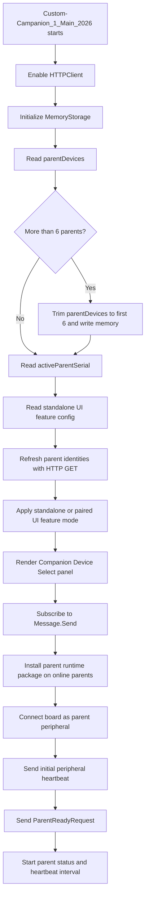
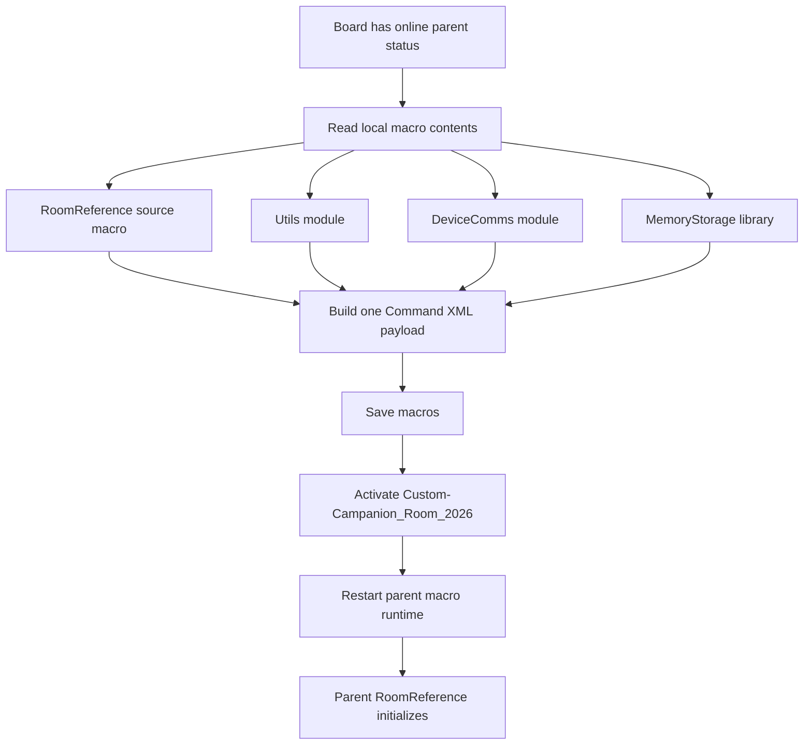
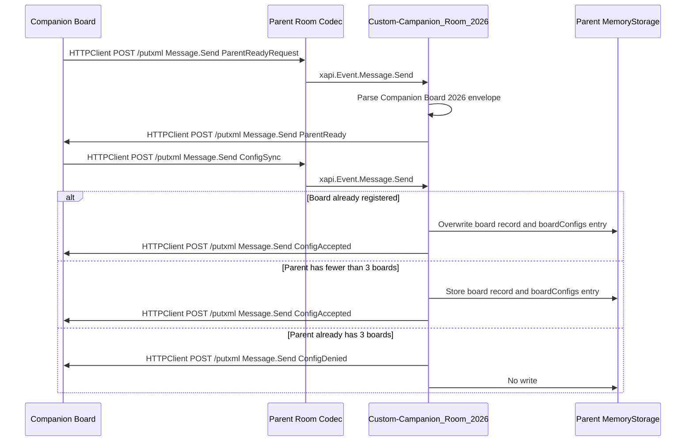
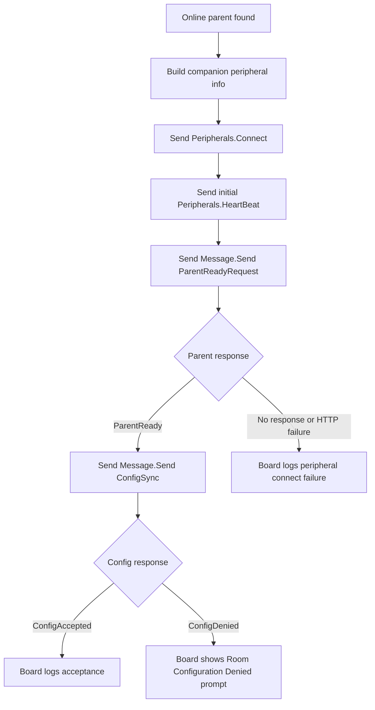
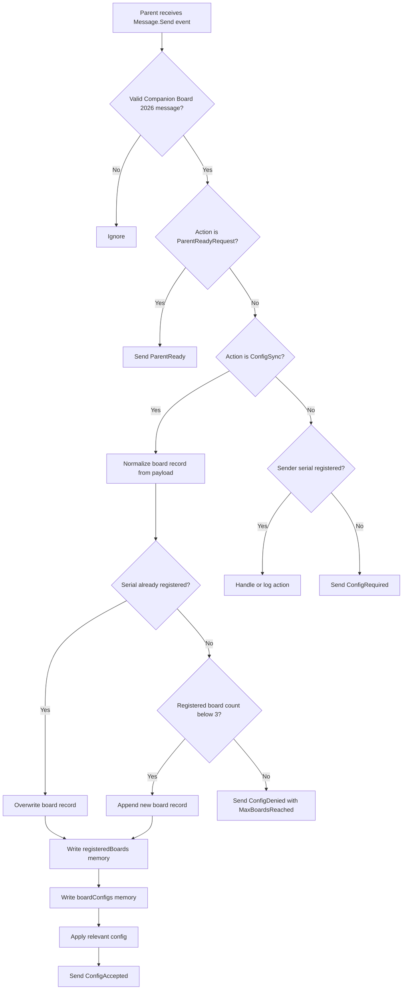
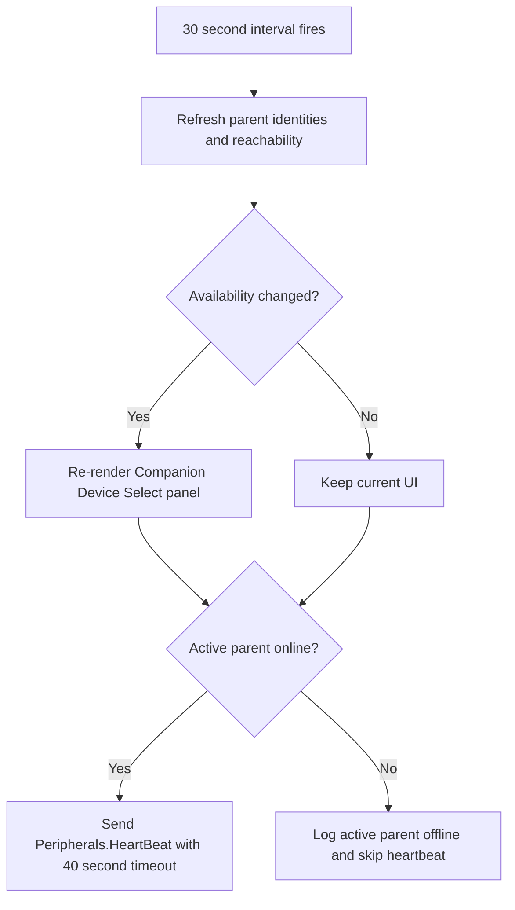
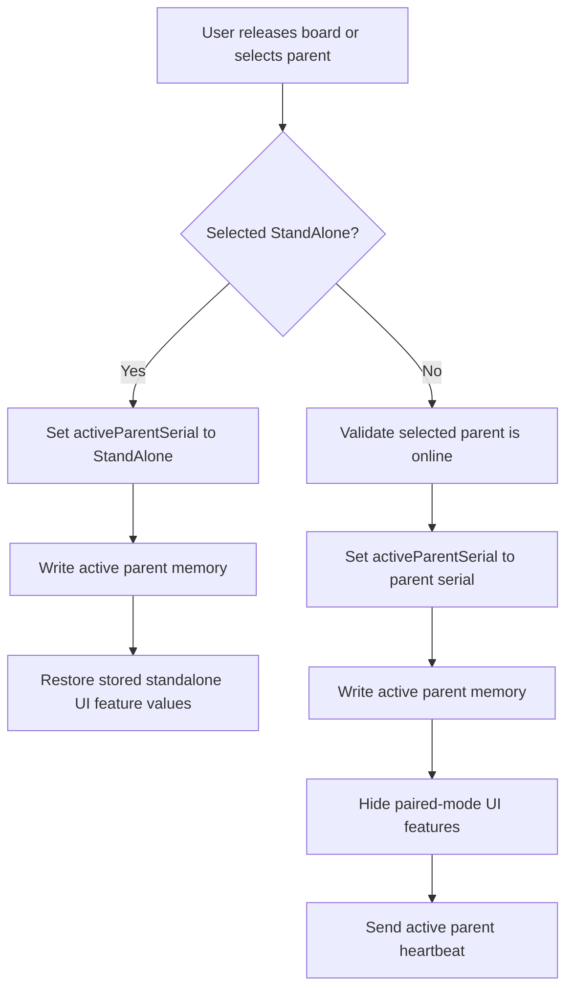

# Custom Companion 2026

Custom Companion 2026 is a Cisco RoomOS macro solution for Board Pro Series endpoints with wheel kits. The solution is intended to let a movable Board Pro be reassigned from room to room and coordinate with a selected parent room device.

## High-Level Scope

- Maintain a board-local list of parent room devices using `Memory-Storage-Functions-V2`.
- Provide a PIN-protected custom UI for adding, validating, confirming, listing, and removing parent devices.
- Initialize and use RoomOS HTTPClient for device-to-device communication.
- Use Message API and putxml-based routing to sanitize and handle custom communication between the movable board and parent room devices.
- Hide base board UI surfaces except whiteboard, files, and solution-owned custom UI elements.
- When a parent room joins a call, instruct the movable board to join the same meeting or call context.
- Keep the board camera muted by default, microphones muted, and volume effectively inaudible while preventing accidental user changes where needed.

## Current Runtime Roles

- Companion board: the movable Board Pro or Board device running `Custom-Campanion_1_Main_2026`.
- Parent room device: the fixed room codec that receives the installed `Custom-Campanion_Room_2026` macro.
- Memory storage: generated state owned by `Memory-Storage-Functions-V2`; this stores board parent-device records and parent registered-board records.
- Transport: RoomOS HTTPClient posts putxml payloads to remote codecs, usually to invoke `Message.Send`, `Peripherals.Connect`, `Peripherals.HeartBeat`, or macro save/activate commands.

## Initialization

The companion board initializes first. It loads local state, validates known parent devices, installs the parent-side runtime package, connects itself as a peripheral, and asks each online parent to confirm that the runtime is ready before sending board-owned configuration.



## Parent Macro Installation

The board installs the parent-room runtime onto each online parent codec. The installed runtime name is `Custom-Campanion_Room_2026`; helper modules are copied with their numbered source names. Board configuration stays on the board and is sent later with `ConfigSync`.

The macro save, activate, and runtime restart operations are sent in one putxml command payload. Commands share one `<Command>` root and are grouped under the correct common path nodes; configuration XML is not mixed into this command payload.



## Codec to Codec Communication

Codec-to-codec commands use the board or parent HTTPClient to post XML to the remote codec `/putxml` endpoint. Custom application messages are carried inside RoomOS `Message.Send` as a JSON envelope.



## Message Envelope

Every custom application message produced by `deviceComms.sendMessageCommand` uses this JSON shape inside `Command.Message.Send`:

```json
{
  "App": "Companion Board 2026",
	"Action": "ConfigSync",
  "Serial": "sending device serial",
  "Source": {
	"Role": "Board",
	"Name": "source display name",
	"Host": "source IP or host",
	"MacAddress": "source MAC when known"
  },
  "Payload": {}
}
```

The envelope is intentionally small because RoomOS `Message.Send` text is limited to 8192 characters. Timestamps are left to the macro logs, serial data is only sent once at the top level, and empty `Source` fields are omitted. `ParentReadyRequest` and `ConfigSync` are intentionally allowed before the parent recognizes the board serial. Other parent-side custom actions require the sending serial to already exist in the parent `registeredBoards` memory list.

## Board Configuration Handoff

Configuration handoff happens after the parent runtime package is installed and the board is connected as a RoomOS peripheral. The parent confirms readiness first, then the board sends the current board-owned config by custom message.



The `ParentReadyRequest` payload currently includes return-path credentials:

- `Board.Username`
- `Board.Password`

Board serial, board name, and MAC address are not stored in base config. The board pulls those values from local xAPI at runtime and places them in the message envelope when needed.

The `ConfigSync` payload currently includes:

- `Config`
- `Board.Username`
- `Board.Password`
- `Board.ProductPlatform`
- `Capabilities.CanJoinCall`
- `Capabilities.CanMuteAudio`
- `Capabilities.CanMuteVideo`
- `Capabilities.CanReceiveMessages`

## Parent Configuration Handling

Each parent codec can store up to 3 registered companion boards. `ConfigSync` saves the board config into `boardConfigs` by board serial and updates the `registeredBoards` record. A repeated sync overwrites existing records when the serial matches.



If the parent accepts or denies configuration but cannot send the response back to the board with the credentials supplied by the board, the parent shows a touch panel prompt: `Companion Registration Error`.

## Parent Selection and Ongoing Heartbeat

The board keeps tracking parent availability and maintains the active parent peripheral heartbeat.



## UI Feature Mode

The board switches between standalone and paired behavior based on the active parent selection.

`config.UserInterface.WebWidget.CompanionWidget.enabled` is `true` by default. The board reads the current Web Widget from `Status.UserInterface.WebView` and saves its URL and restore metadata once into memory. By default, Companion Widget is shown in both standalone and paired modes; set `config.UserInterface.WebWidget.CompanionWidget.restoreStandaloneExisting` to `true` to restore the original Web Widget when unpaired. In paired mode, the board removes its own Companion widget when needed with `UserInterface.Extensions.WebWidget.Remove`, then saves the built-in Simple-WebWidget URL with hash parameters unless `config.UserInterface.WebWidget.urlOverride` is supplied. Configurable CompanionWidget hash fields include weather.mode, weather.latitude, weather.longitude, weather.temperatureUnit, time.mode, time.timeZone, context-specific info2, context-specific info3, and context-specific iconUrl. The board supplies theme, heading, info1, and `hideSettings=true` in code, and re-saves the widget if `UserInterface Theme Name` changes.

Standalone standby preferences are saved in board memory for `Standby Control`, `Standby Halfwake Mode`, and `Time OfficeHours Enabled`. In paired mode, the board forces those values to `Off`, `Manual`, and `False` so it does not enter standby independently. When a parent is selected, the board clears any pending standby sync or bypass state, reads that parent's current `Status.Standby.State` directly, and parent rooms also subscribe to `Status.Standby.State` to send debounced `StandbySync` messages to registered boards; a board only follows standby commands from its active paired parent. The board shows one 30-second prompt before applying `Off`, `Standby`, or `Halfwake`, refreshes the prompt countdown in place, applies the latest valid state at the deadline, and ignores `EnteringStandby`. A user can start 5-minute or 30-minute bypass windows; while bypass is active, parent standby commands are ignored and the Web Widget `info3` shows `Standby sync bypass until HH:MM AM/PM`.



## Custom Routes and Actions

The current source keeps a small route map in `Custom-Campanion_1_Main_2026`. The new Message API envelope uses `Action`; older route-like names are still listed here because they are defined as solution routes and are expected to be used by future call-control work.

| Route or Action | Direction | Current Status | Purpose |
| --- | --- | --- | --- |
| `ParentReadyRequest` | Board to parent | Implemented | Board asks the freshly installed parent runtime to confirm it is ready and provides return-path credentials. |
| `ParentReady` | Parent to board | Implemented | Parent confirms the runtime is active and ready to receive board-owned configuration. |
| `ConfigSync` | Board to parent | Implemented | Board sends the current config, board return credentials, and capabilities. |
| `ConfigAccepted` | Parent to board | Implemented | Parent confirms config was stored in `boardConfigs` and board identity was stored or updated in `registeredBoards`. |
| `ConfigDenied` | Parent to board | Implemented | Parent rejects config from a new board when its 3-board registration limit is reached. |
| `ConfigRequired` | Parent to board | Implemented guard response | Parent receives an unsupported action from an unknown board serial and asks the board to send config first. |
| `StandbySync` | Parent to board | Implemented | Parent sends its debounced standby state to registered boards; boards only act when the sending parent serial matches their active parent. |
| `CallSync` | Parent to board | Initial detection slice | Parent captures the outgoing `Call RemoteNumber` with a one-shot status listener, pairs it with `CallSuccessful`, and sends the call details to registered boards. |
| `parent.callState` | Parent to board | Defined route | Reserved for parent call-state updates. |
| `board.joinCall` | Parent to board | Defined route | Reserved for instructing the board to join the selected parent call context. |

## Limits and Storage

- One companion board can keep up to 6 parent devices in board memory.
- One parent room codec can register up to 3 companion boards in parent memory.
- Re-syncing the same board serial updates that board record and its `boardConfigs` entry instead of consuming another slot.
- `Custom-Campanion-Storage.js` is generated database state and should not be edited or committed as source.

## Notes

`Custom-Campanion-Storage.js` is generated database state managed by the memory storage library and should not be edited or committed as source.
