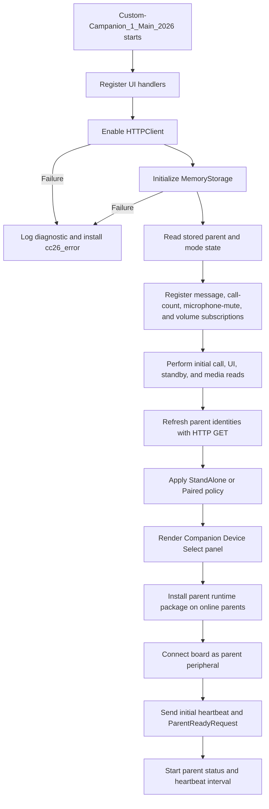
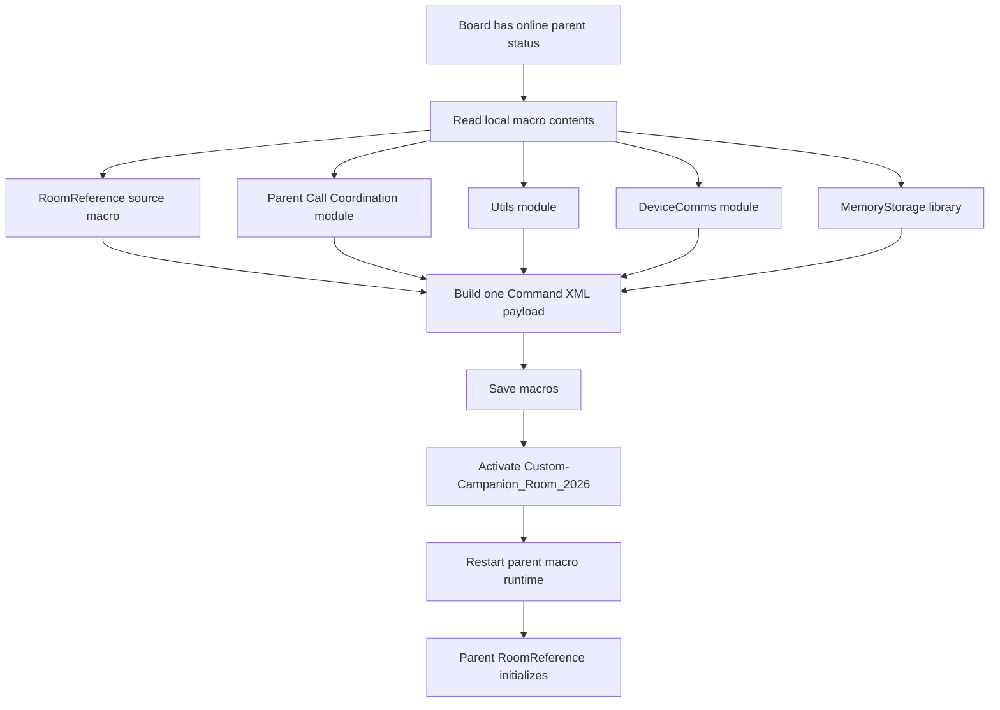
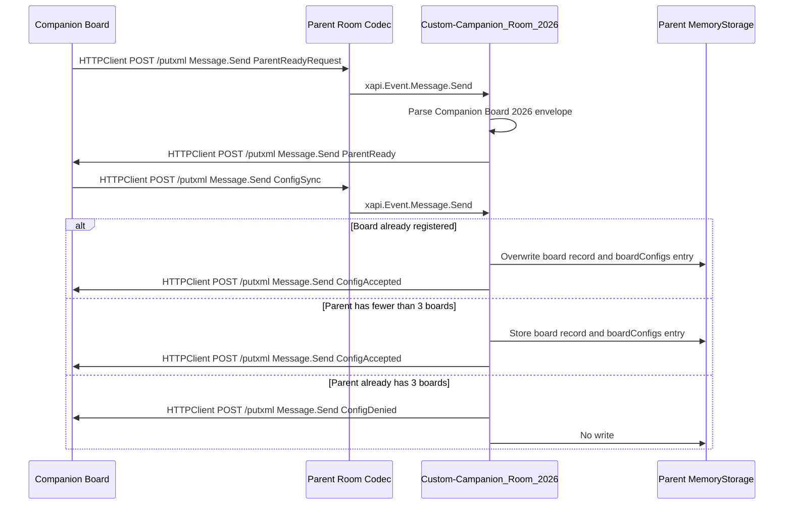
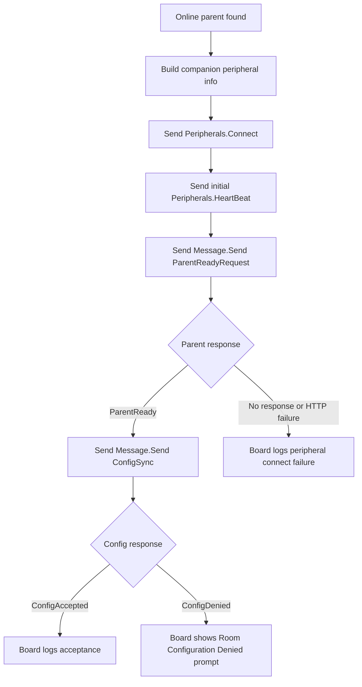
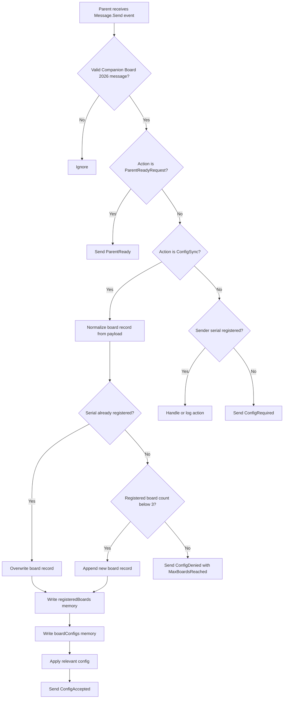
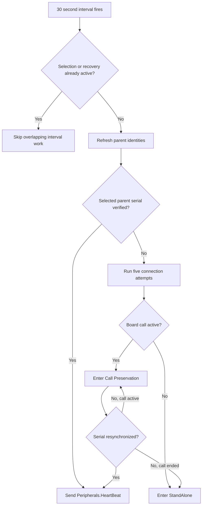
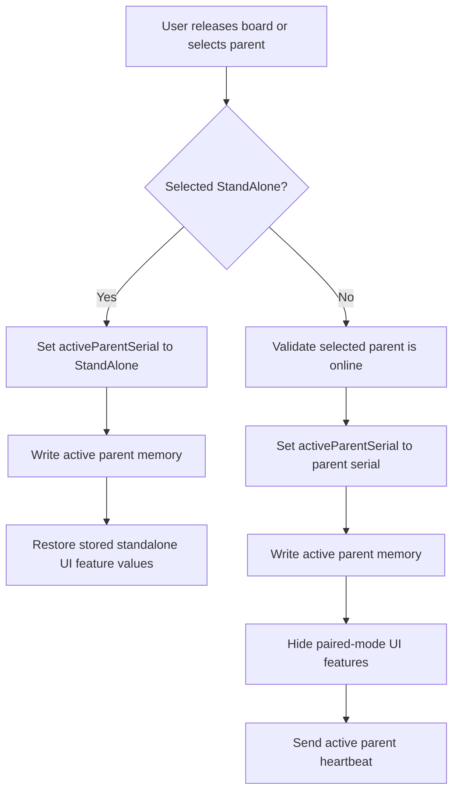

# Custom Companion 2026

Custom Companion 2026 is a Cisco RoomOS macro solution for Board Pro Series endpoints with wheel kits. The solution is intended to let a movable Board Pro be reassigned from room to room and coordinate with a selected parent room device.

## High-Level Scope

- Maintain a board-local list of parent room devices using `Memory-Storage-Functions-V2`.
- Provide the Companion Device Select UI for listing configured parents, selecting an online parent, and returning the board to StandAlone. The visible Config/PIN widgets are placeholders; parent-management and PIN behavior are not implemented in the current runtime.
- Initialize and use RoomOS HTTPClient for device-to-device communication.
- Use Message API and putxml-based routing to sanitize and handle custom communication between the movable board and parent room devices.
- Apply an explicit Paired UI policy that keeps Video Mute, Participants, and Whiteboard available while hiding the other known call/share controls; native Raise Hand remains subject to device acceptance testing.
- When a parent room joins a supported Webex call, instruct the movable board to join the same call context.
- Keep microphones muted and volume at level 1 while Paired, while leaving Video Mute available as a user control.

## Current Runtime Roles

- Companion board: the movable Board Pro or Board device running `Custom-Campanion_1_Main_2026`.
- Parent room device: the fixed room codec that receives the installed `Custom-Campanion_Room_2026` macro.
- Memory storage: generated state owned by `Memory-Storage-Functions-V2`; this stores board parent-device records and parent registered-board records.
- Transport: RoomOS HTTPClient posts putxml payloads to remote codecs, usually to invoke `Message.Send`, `Peripherals.Connect`, `Peripherals.HeartBeat`, or macro save/activate commands.

## Source Macro Architecture

The deployable source remains unbundled and uses 13 numbered macros. On the companion board, only `Custom-Campanion_1_Main_2026` is the active entry macro; its imported modules and the two parent deployment sources remain present under their numbered names. This keeps each stateful workflow independently readable while preserving RoomOS Macro Editor deployment.

| Macro | Responsibility |
| --- | --- |
| `Custom-Campanion_1_Main_2026` | Companion board entry, initialization order, selection transitions, Unhealthy handling, and cross-controller coordination. |
| `Custom-Campanion_2_Config_2026` | Deployment configuration. `pinProtection` remains a Deferred Surface and is not executable behavior. |
| `Custom-Campanion_3_Utils_2026` | Structured logging and soft/hard diagnostic boundaries. |
| `Custom-Campanion_4_UI_2026` | Panel XML, prompts, widget state, and Companion WebWidget adapter. The visible Config/PIN page remains a Deferred Surface. |
| `Custom-Campanion_5_State_2026` | Storage keys, safe MemoryStorage reads, and basic board mode state. |
| `Custom-Campanion_6_DeviceComms_2026` | HTTP transport, queue policy, Message envelope, putxml builders, and XML parsing. |
| `Custom-Campanion_7_RoomReference_2026` | Inactive parent entry source; installed and activated on a parent as `Custom-Campanion_Room_2026`. |
| `Custom-Campanion_8_Services_2026` | Parent package provisioning and runtime companion-board identity discovery. |
| `Custom-Campanion_9_ParentConnectivity_2026` | Parent identity refresh, retries, heartbeat, recovery, and Call Preservation. |
| `Custom-Campanion_10_PairedEnvironment_2026` | Paired UI policy, WebWidget mode, microphone/volume enforcement, and safe release restoration. |
| `Custom-Campanion_11_BoardCallSync_2026` | Board-side Webex call synchronization, disconnect, rejoin, retries, and call messaging. |
| `Custom-Campanion_12_ParentCallCoordination_2026` | Parent-side call/BYOD detection, participant admission, and call-detail responses. |
| `Custom-Campanion_13_StandbyCoordination_2026` | StandAlone standby preferences, parent standby sync, delayed application, prompts, and bypass. |

No build or bundling step is required. A future deployment tool may install these source macros after core behavior is complete, but it must not change their runtime boundaries. See [ADR 0001](docs/adr/0001-unbundled-domain-macros.md).

## Initialization

The companion board initializes first. It registers the error-panel interaction, initializes HTTPClient and MemoryStorage, loads local state, registers call/media subscriptions, validates known parent devices, applies local mode policy, installs the parent-side runtime package, connects itself as a peripheral, and asks each online parent to confirm that the runtime is ready before sending board-owned configuration. HTTPClient or MemoryStorage failure stops initialization, logs a stable administrator diagnostic, removes `cc26`, and installs the gray widgetless `cc26_error` action panel.



## Parent Macro Installation

The board installs the parent-room runtime onto each online parent codec. The installed runtime name is `Custom-Campanion_Room_2026`; `Custom-Campanion_12_ParentCallCoordination_2026`, Utils, DeviceComms, and MemoryStorage are copied as dependencies. Only `Custom-Campanion_Room_2026` is activated. Board configuration stays on the board and is sent later with `ConfigSync`.

The macro save, activate, and runtime restart operations are sent in one putxml command payload. Commands share one `<Command>` root and are grouped under the correct common path nodes; configuration XML is not mixed into this command payload.



## Codec to Codec Communication

Codec-to-codec commands use the board or parent HTTPClient to post XML to the remote codec `/putxml` endpoint. Custom application messages are carried inside RoomOS `Message.Send` as a JSON envelope. DeviceComms is the only HTTPClient call site: it allows three active requests, limits the pending queue to 50, applies an internal three-second timeout, requests `PlainText` response bodies, accepts only HTTP 200–299, and never retries. Equivalent periodic identity, call-status, and heartbeat work is coalesced; all other state-changing commands are admitted FIFO and never coalesced.

DeviceComms parses the RoomOS response XML without external dependencies. The QuickJS-compatible parser supports declarations, comments, elements, self-closing elements, attributes, repeated siblings, text, standard/numeric entities, and CDATA. It rejects malformed XML, document-type/entity declarations, non-2xx responses, `<Error>` elements, and `status="Error"` markers. Administrator diagnostics include stable codes plus method, host, path, status/reason when available, and a bounded response excerpt; credentials and submitted payloads are not logged.



## Message Envelope

Every custom application message produced by `deviceComms.sendMessageCommand` uses this JSON shape inside `Command.Message.Send`:

```json
{
  "App": "Companion Board 2026",
	"Action": "ConfigSync",
  "Serial": "sending device serial",
  "Source": {
	"Role": "Board",
	"Name": "source display name",
	"Host": "source IP or host",
	"MacAddress": "source MAC when known"
  },
  "Payload": {}
}
```

The envelope is intentionally small because RoomOS `Message.Send` text is limited to 8192 characters. Timestamps are left to the macro logs, serial data is only sent once at the top level, and empty `Source` fields are omitted. `ParentReadyRequest` and `ConfigSync` are intentionally allowed before the parent recognizes the board serial. Other parent-side custom actions require the sending serial to already exist in the parent `registeredBoards` memory list.

## Board Configuration Handoff

Configuration handoff happens after the parent runtime package is installed and the board is connected as a RoomOS peripheral. The parent confirms readiness first, then the board sends the current board-owned config by custom message.



The `ParentReadyRequest` payload currently includes return-path credentials:

- `Board.Username`
- `Board.Password`

Board serial, board name, and MAC address are not stored in base config. The board pulls those values from local xAPI at runtime and places them in the message envelope when needed.

The `ConfigSync` payload currently includes:

- `Config`
- `Board.Username`
- `Board.Password`
- `Board.ProductPlatform`
- `Capabilities.CanJoinCall`
- `Capabilities.CanMuteAudio`
- `Capabilities.CanMuteVideo`
- `Capabilities.CanReceiveMessages`

## Parent Configuration Handling

Each parent codec can store up to 3 registered companion boards. `ConfigSync` saves the board config into `boardConfigs` by board serial and updates the `registeredBoards` record. A repeated sync overwrites existing records when the serial matches.



If the parent accepts or denies configuration but cannot send the response back to the board with the credentials supplied by the board, the parent shows a touch panel prompt: `Companion Registration Error`.

## Parent Selection and Ongoing Heartbeat

The board keeps tracking parent availability and maintains the active parent peripheral heartbeat. Selecting a parent runs a serial-verified identity check with up to five attempts and five seconds between completed failures. `info3` shows `Connecting to {room} — attempt {N} of 5`. A failed selection never restores the previous parent: the board enters StandAlone, shows the neutral `Room Unavailable` prompt, and displays `Unable to connect to {room}. Running Stand Alone.` for 60 seconds.

An active Paired parent that becomes unavailable follows the same five-attempt path. If the board has no active call, it enters StandAlone. If a call is active, it enters Call Preservation State, keeps the current parent assignment and call intact, exposes the native End Call control, and continues one serial-verified network attempt every five seconds. `info3` remains `{room} is temporarily unavailable. Your call will continue.` until communication recovers or the call ends. A matching serial response restores normal Paired controls; a call ending before recovery returns the board to StandAlone.



## UI Feature Mode

The board switches between standalone and paired behavior based on the active parent selection.

`config.UserInterface.WebWidget.CompanionWidget.enabled` is `true` by default. The board reads the current Web Widget from `Status.UserInterface.WebView` and saves its URL and restore metadata once into memory. By default, Companion Widget is shown in both standalone and paired modes; set `config.UserInterface.WebWidget.CompanionWidget.restoreStandaloneExisting` to `true` to restore the original Web Widget when unpaired. In paired mode, the board removes its own Companion widget when needed with `UserInterface.Extensions.WebWidget.Remove`, then saves the built-in Simple-WebWidget URL with hash parameters unless `config.UserInterface.WebWidget.urlOverride` is supplied. Configurable CompanionWidget hash fields include weather.mode, weather.latitude, weather.longitude, weather.temperatureUnit, time.mode, time.timeZone, context-specific info2, context-specific info3, and context-specific iconUrl. The board supplies theme, heading, info1, and `hideSettings=true` in code, and re-saves the widget if `UserInterface Theme Name` changes.

Standalone standby preferences are saved in board memory for `Standby Control`, `Standby Halfwake Mode`, and `Time OfficeHours Enabled`. In paired mode, the board forces those values to `Off`, `Manual`, and `False` so it does not enter standby independently. When a parent is selected, the board clears any pending standby sync or bypass state, reads that parent's current `Status.Standby.State` directly, and shows one 30-second prompt before applying `Off`, `Standby`, or `Halfwake`. Parent rooms also subscribe to `Status.Standby.State` and send debounced `StandbySync` messages to registered boards; after pairing, the board follows those active-parent standby commands immediately without showing a prompt. The board ignores `EnteringStandby`. A user can start 5-minute or 30-minute bypass windows; while bypass is active, parent standby commands are ignored and the Web Widget `info3` shows `Standby sync bypass until HH:MM AM/PM`. Runtime `info3` precedence is parent connectivity/Call Preservation, call synchronization, then standby.

The editable Paired UI policy is in `Custom-Campanion_10_PairedEnvironment_2026`. It captures supported StandAlone values and restores them on release. Video Mute, Participant List, and Whiteboard Start are set to `Auto`; the other known call controls plus Share Start are set to `Hidden`. Call End is `Hidden` during normal Paired operation and temporarily `Auto` during Call Preservation or an active-call Unhealthy State. Unsupported optional feature paths are logged and skipped. Because RoomOS does not expose a dedicated Raise Hand visibility configuration, device acceptance must confirm Raise Hand remains available with MidCallControls hidden.

While Paired, the board performs initial reads and subscribes to `Status.Audio.Microphones.Mute` and `Status.Audio.Volume`. An observed unmute invokes `Command.Audio.Microphones.Mute` once; a volume other than 1 invokes `Command.Audio.Volume.Set` once with `Level: 1` and no `Device` parameter. Local command failures are not retried. Leaving Paired keeps the microphone state muted. If no call is active, the board immediately reads `Config.Audio.DefaultVolume`, restores that value, and reminds the user to unmute. If a call is active, the board enters StandAlone immediately and asks whether to restore volume; decline, dismissal, or prompt failure leaves the level unchanged.



## Unhealthy State and Administrator Communication

Required local prerequisite failures and required Paired microphone/volume enforcement failures enter an Unhealthy State. The console logs a stable code, component, context, remediation, and original error without credentials. The normal selection panel is replaced by the gray widgetless `cc26_error` action panel, blocking parent selection. Clicking it shows `Contact a Device Administrator.` for up to 30 seconds with a Dismiss option. Recovery requires correcting the local macro/xAPI issue and restarting the Macro Runtime; no background initialization retry or self-restart is attempted.

If required media enforcement fails during an active call, the board remains assigned, exposes End Call, and leaves the call, microphone, and volume unchanged. When the call ends it enters StandAlone, attempts the now-safe default-volume restoration once, and remains Unhealthy until restart.

## Explicit RoomOS xAPI Contracts

| Purpose | Initial read or command | Subscription |
| --- | --- | --- |
| Local call safety | `xapi.Status.SystemUnit.State.NumberOfActiveCalls.get()` | `xapi.Status.SystemUnit.State.NumberOfActiveCalls.on(...)` |
| Paired microphone enforcement | `xapi.Status.Audio.Microphones.Mute.get()` and `xapi.Command.Audio.Microphones.Mute()` | `xapi.Status.Audio.Microphones.Mute.on(...)` |
| Paired volume enforcement | `xapi.Status.Audio.Volume.get()` and `xapi.Command.Audio.Volume.Set({ Level: 1 })` | `xapi.Status.Audio.Volume.on(...)` |
| StandAlone volume restoration | `xapi.Config.Audio.DefaultVolume.get()` and `xapi.Command.Audio.Volume.Set({ Level })` | None; current default is read at the release boundary |
| Error action button | `xapi.Command.UserInterface.Extensions.Panel.Save/Remove` | `xapi.Event.UserInterface.Extensions.Panel.Clicked.on(...)`, gated to `cc26_error` |
| Parent identity | `xapi.Command.HttpClient.Get` for `/getxml?location=/Status/SystemUnit` | Five-second workflow retries; no HTTP transport retry |
| Parent standby | `xapi.Command.HttpClient.Get` for `/getxml?location=/Status/Standby/State` | Parent `xapi.Status.Standby.State.on(...)` sends `StandbySync` |
| Board call validation | `xapi.Command.HttpClient.Get` for `/getxml?location=/Status/Call` | Parent admission workflow invokes the queued read |
| Remote commands/messages | `xapi.Command.HttpClient.Post` to `/putxml` | Remote `xapi.Event.Message.Send.on(...)` receives Custom Companion envelopes |

## Custom Routes and Actions

The current source keeps a small route map in `Custom-Campanion_1_Main_2026`. The new Message API envelope uses `Action`; older route-like names are still listed here because they are defined as solution routes and are expected to be used by future call-control work.

| Route or Action | Direction | Current Status | Purpose |
| --- | --- | --- | --- |
| `ParentReadyRequest` | Board to parent | Implemented | Board asks the freshly installed parent runtime to confirm it is ready and provides return-path credentials. |
| `ParentReady` | Parent to board | Implemented | Parent confirms the runtime is active and ready to receive board-owned configuration. |
| `ConfigSync` | Board to parent | Implemented | Board sends the current config, board return credentials, and capabilities. |
| `ConfigAccepted` | Parent to board | Implemented | Parent confirms config was stored in `boardConfigs` and board identity was stored or updated in `registeredBoards`. |
| `ConfigDenied` | Parent to board | Implemented | Parent rejects config from a new board when its 3-board registration limit is reached. |
| `ConfigRequired` | Parent to board | Implemented guard response | Parent receives an unsupported action from an unknown board serial and asks the board to send config first. |
| `StandbySync` | Parent to board | Implemented | Parent sends its debounced standby state to registered boards; boards only act when the sending parent serial matches their active parent. |
| `CallSync` | Parent to board | Webex-only join/disconnect slice | Parent captures the first `Call RemoteNumber` value with a new-style one-shot status listener, pairs it with `CallSuccessful` or active call count, stores active call details in runtime state, enriches with meeting platform/protocol or BYOD state, and sends details to registered boards. Active boards only auto-join Webex calls. If the board drops the call while paired, it requests active call details from the parent and only rejoins when the response matches the same synced call by `CallId`, `RemoteURI`, or `RemoteNumber`. When the parent is the Webex host, it searches the participant list on `Conference.ParticipantList.ParticipantUpdated` and also polls `ParticipantList.Search` every few seconds while admission is pending, matches waiting registered boards by display name, validates the board's `Status.Call CallbackNumber` against the parent call, and admits the board until it is no longer waiting. If the parent is not host, the board Web Widget `info3` tells users the host needs to admit it. Zoom, Microsoft Teams, Google Meet, SIP/H.323 bridge, and BYOD calls are identified but out of scope. Parent also watches `Status.SystemUnit.State.NumberOfActiveCalls` and sends a disconnect payload when its active call count drops below 1. |
| `ActiveCallDetailsRequest` | Board to parent | Implemented | Board asks the active parent for its stored active call details after a local call drop, then uses the `CallSync` response to decide whether rejoin is still valid. |
| `parent.callState` | Parent to board | Defined route | Reserved for parent call-state updates. |
| `board.joinCall` | Parent to board | Defined route | Reserved for instructing the board to join the selected parent call context. |

## Limits and Storage

- One companion board can keep up to 6 parent devices in board memory.
- One parent room codec can register up to 3 companion boards in parent memory.
- Re-syncing the same board serial updates that board record and its `boardConfigs` entry instead of consuming another slot.
- `Custom-Campanion-Storage.js` is generated database state and should not be edited or committed as source.

## Notes

`Custom-Campanion-Storage.js` is generated database state managed by the memory storage library and should not be edited or committed as source.
