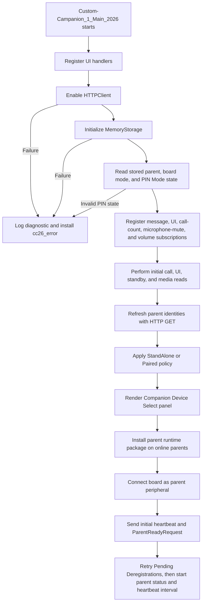
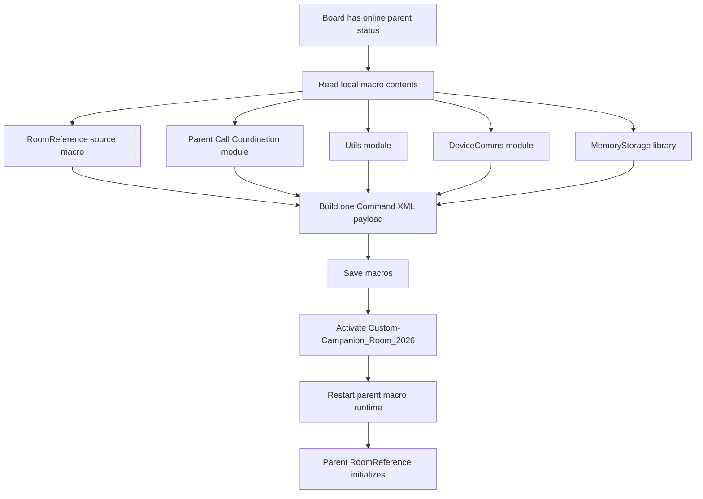
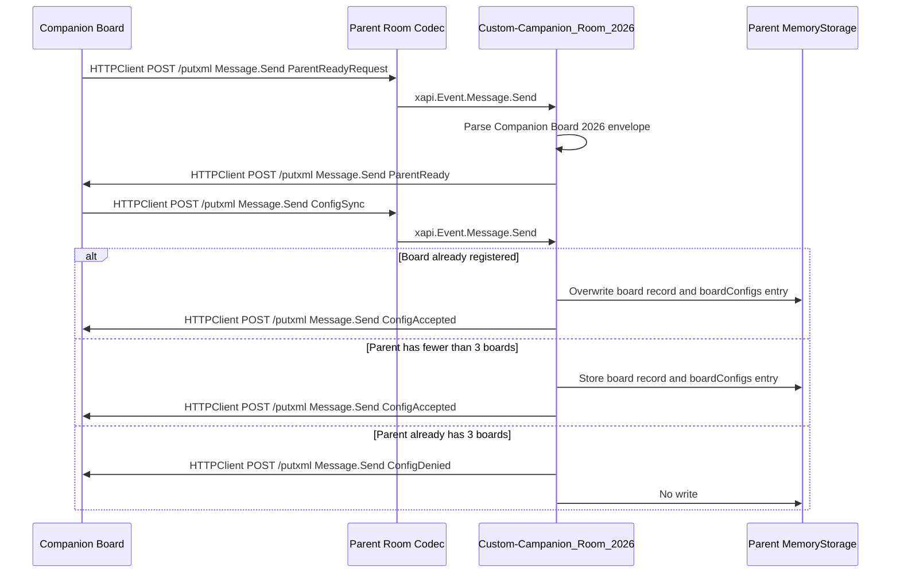
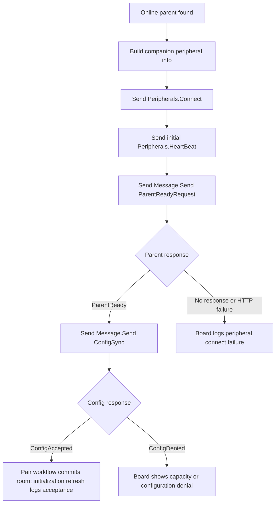
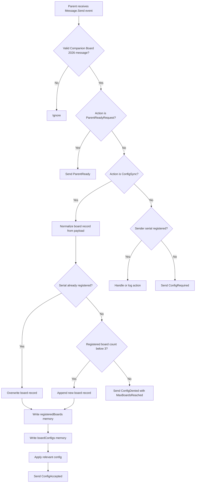
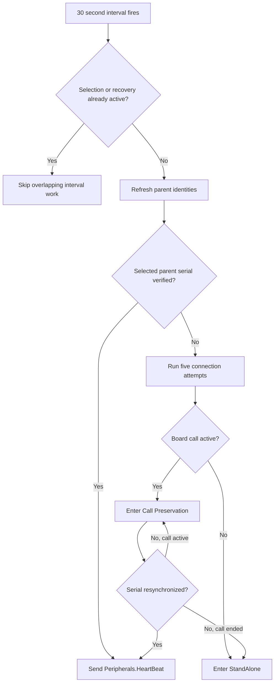
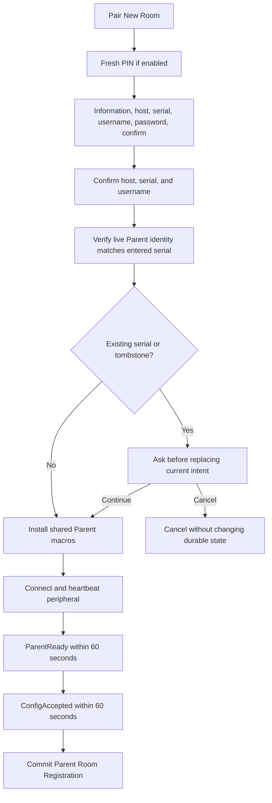
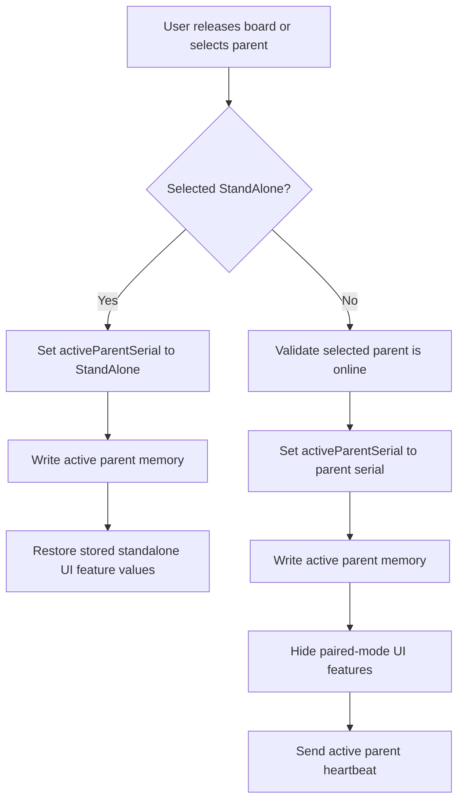

# Custom Companion 2026

Custom Companion 2026 is a Cisco RoomOS macro solution for Board Pro Series endpoints with wheel kits. The solution is intended to let a movable Board Pro be reassigned from room to room and coordinate with a selected parent room device.

## High-Level Scope

- Maintain a board-local list of parent room devices using `Memory-Storage-Functions-V2`.
- Provide PIN-gated Companion Device Select access for registering and deleting parent rooms, listing configured parents, selecting an online parent, returning the board to StandAlone, and managing PIN Mode from the Config page.
- Initialize and use RoomOS HTTPClient for device-to-device communication.
- Use Message API and putxml-based routing to sanitize and handle custom communication between the movable board and parent room devices.
- Apply an explicit Paired UI policy that keeps Video Mute, Participants, and Whiteboard available while hiding the other known call/share controls; native Raise Hand remains subject to device acceptance testing.
- When a parent room joins a supported Webex call, instruct the movable board to join the same call context.
- Keep microphones muted, volume at level 1, and a renewable Do Not Disturb lease active while Paired, while leaving Video Mute available as a user control.

## Current Runtime Roles

- Companion board: the movable Board Pro or Board device running `Custom-Campanion_1_Main_2026`.
- Parent room device: the fixed room codec that receives the installed `Custom-Campanion_Room_2026` macro.
- Memory storage: generated state owned by `Memory-Storage-Functions-V2`; this stores board parent-device records, Pending Deregistration tombstones, board PIN Mode state, and parent registered-board records.
- Transport: RoomOS HTTPClient posts putxml payloads to remote codecs, usually to invoke `Message.Send`, `Peripherals.Connect`, `Peripherals.HeartBeat`, or macro save/activate commands. Parent cleanup uses local `Peripherals.Purge`.

## Source Macro Architecture

The deployable source remains unbundled and uses 15 numbered macros. On the companion board, only `Custom-Campanion_1_Main_2026` is the active entry macro; its imported modules and the two parent deployment sources remain present under their numbered names. This keeps each stateful workflow independently readable while preserving RoomOS Macro Editor deployment.

| Macro | Responsibility |
| --- | --- |
| `Custom-Campanion_1_Main_2026` | Companion board entry, initialization order, selection transitions, Unhealthy handling, and cross-controller coordination. |
| `Custom-Campanion_2_Config_2026` | Deployment configuration, including first-initialization `pinMode.defaults`. |
| `Custom-Campanion_3_Utils_2026` | Structured logging and soft/hard diagnostic boundaries. |
| `Custom-Campanion_4_UI_2026` | Access/hidden panel XML, PIN and status prompts, widget state, and Companion WebWidget adapter. |
| `Custom-Campanion_5_State_2026` | Storage keys, safe MemoryStorage reads, and basic board mode state. |
| `Custom-Campanion_6_DeviceComms_2026` | HTTP transport, queue policy, Message envelope, putxml builders, and XML parsing. |
| `Custom-Campanion_7_RoomReference_2026` | Inactive parent entry source; installed and activated on a parent as `Custom-Campanion_Room_2026`. |
| `Custom-Campanion_8_Services_2026` | Parent package provisioning and runtime companion-board identity discovery. |
| `Custom-Campanion_9_ParentConnectivity_2026` | Parent identity refresh, retries, heartbeat, recovery, and Call Preservation. |
| `Custom-Campanion_10_PairedEnvironment_2026` | Paired UI policy, WebWidget mode, microphone/volume/DND enforcement, and safe release restoration. |
| `Custom-Campanion_11_BoardCallSync_2026` | Board-side Webex call synchronization, disconnect, rejoin, retries, and call messaging. |
| `Custom-Campanion_12_ParentCallCoordination_2026` | Parent-side call/BYOD detection, participant admission, and call-detail responses. |
| `Custom-Campanion_13_StandbyCoordination_2026` | StandAlone standby preferences, parent standby sync, delayed application, prompts, and bypass. |
| `Custom-Campanion_14_PinMode_2026` | Board-local PIN state, protected-panel access, edit/disable verification, persistence retry, and inactivity session. |
| `Custom-Campanion_15_ParentRegistration_2026` | Pair New Room wizard, locked provisioning stages, long-hold deregistration, tombstones, and reconciliation. |

No build or bundling step is required for the runtime macros. The Companion Installer installs these source files without changing their runtime boundaries. See [ADR 0001](docs/adr/0001-unbundled-domain-macros.md).

## Companion Installer

The static browser installer in `installer/` deploys a selected release or the current Main Fork (Beta) snapshot to a companion board through JSXAPI. The root `manifest.json` is the Release Manifest and remains authoritative for installable project macros, minimum RoomOS, supported product platforms, and external dependencies. The installer never targets a parent room device; the installed board runtime retains parent provisioning ownership.

After Board configuration and before Review, the installer requires the Device Administrator to choose a Standard Installation or Clean Installation. Standard Installation preserves `Custom-Campanion-Storage`. Clean Installation deactivates the existing project macros, removes only `Custom-Campanion-Storage` when present, and then installs the selected release. This permanently resets the board's saved parent devices, Pending Deregistration tombstones, active parent selection, PIN Mode state, and captured StandAlone UI and standby settings. Generated storage remains outside the Release Manifest and is never treated as a Legacy Project Macro.

Before packaging, `npm run verify:release` checks that the Release Manifest exactly covers the eligible root macros, the runtime project version is synchronized across Main, Config, `config.version`, and RoomReference, every macro passes JavaScript syntax validation, relative macro imports resolve to Release Manifest resources, and Main still emits the initialization messages used by installer verification. Installer tests and builds run the same Release Contract verification before generating the pinned source snapshot.

See `installer/README.md` for local commands and ADR 0002 through ADR 0005 for source selection, credentials, Board Identity Confirmation, and forward-only installation decisions.

## Initialization

The companion board initializes first. It registers the UI event routes, initializes HTTPClient and MemoryStorage, loads local state including PIN Mode and Pending Deregistrations, registers call/media subscriptions, validates known parent devices, applies local mode policy, installs the parent-side runtime package, connects itself as a peripheral, asks each online parent to confirm that the runtime is ready before sending board-owned configuration, and makes one cleanup attempt for each tombstone. HTTPClient, MemoryStorage, or PIN Mode initialization failure stops initialization, logs a stable administrator diagnostic, removes `cc26_access`, `cc26_hidden`, and legacy `cc26`, and installs the gray widgetless `cc26_error` action panel.



## Parent Macro Installation

The board installs the parent-room runtime onto each online parent codec. The installed runtime name is `Custom-Campanion_Room_2026`; `Custom-Campanion_12_ParentCallCoordination_2026`, Utils, DeviceComms, and MemoryStorage are copied as dependencies. Only `Custom-Campanion_Room_2026` is activated. Board configuration stays on the board and is sent later with `ConfigSync`.

The macro save, activate, and runtime restart operations are sent in one putxml command payload. Commands share one `<Command>` root and are grouped under the correct common path nodes; configuration XML is not mixed into this command payload.



## Codec to Codec Communication

Codec-to-codec commands use the board or parent HTTPClient to post XML to the remote codec `/putxml` endpoint. Custom application messages are carried inside RoomOS `Message.Send` as a JSON envelope. DeviceComms is the only HTTPClient call site: it allows three active requests, limits the pending queue to 50, applies an internal three-second timeout, requests `PlainText` response bodies, accepts only HTTP 200–299, and never retries. Equivalent periodic identity, call-status, and heartbeat work is coalesced; all other state-changing commands are admitted FIFO and never coalesced.

DeviceComms parses the RoomOS response XML without external dependencies. The QuickJS-compatible parser supports declarations, comments, elements, self-closing elements, attributes, repeated siblings, text, standard/numeric entities, and CDATA. It rejects malformed XML, document-type/entity declarations, non-2xx responses, `<Error>` elements, and `status="Error"` markers. Administrator diagnostics include stable codes plus method, host, path, status/reason when available, and a bounded response excerpt; credentials and submitted payloads are not logged.



## Message Envelope

Every custom application message produced by `deviceComms.sendMessageCommand` uses this JSON shape inside `Command.Message.Send`:

```json
{
  "App": "Companion Board 2026",
	"Action": "ConfigSync",
  "Serial": "sending device serial",
  "Source": {
	"Role": "Board",
	"Name": "source display name",
	"Host": "source IP or host",
	"MacAddress": "source MAC when known"
  },
  "Payload": {}
}
```

The envelope is intentionally small because RoomOS `Message.Send` text is limited to 8192 characters. Timestamps are left to the macro logs, serial data is only sent once at the top level, and empty `Source` fields are omitted. Registration messages carry a `Payload.TransactionId` so stale acknowledgements cannot reverse newer intent. `ParentReadyRequest`, `ConfigSync`, and idempotent `DeregisterRequest` are intentionally allowed before the parent recognizes the board serial. Other parent-side custom actions require the sending serial to already exist in the parent `registeredBoards` memory list.

## Board Configuration Handoff

Configuration handoff happens after the parent runtime package is installed and the board is connected as a RoomOS peripheral. The parent confirms readiness first, then the board sends an explicit parent-facing subset of board-owned configuration by custom message. Board-local `pinMode` is never included.



The Pair New Room `ParentReadyRequest` payload includes the runtime board identity and return path:

- `Board.Serial`
- `Board.Name`
- `Board.Host`
- `Board.Username`
- `Board.Password`
- `Board.MacAddress`
- `Board.ProductPlatform`
- `TransactionId`

Board serial, board name, and MAC address are not stored in base config. The board pulls those values from local xAPI at runtime and places them in the message envelope when needed.

The `ConfigSync` payload currently includes:

- `Config` containing `version`, `CompanionBoardInformation`, `httpClient`, and `UserInterface`; board-local `pinMode` is excluded
- `Board.Username`
- `Board.Password`
- `Board.ProductPlatform`
- `TransactionId`
- `Capabilities.CanJoinCall`
- `Capabilities.CanMuteAudio`
- `Capabilities.CanMuteVideo`
- `Capabilities.CanReceiveMessages`

## Parent Configuration Handling

Each parent codec can store up to 3 registered companion boards. `ConfigSync` saves the board config into `boardConfigs` by board serial and updates the `registeredBoards` record. A repeated sync overwrites existing records when the serial matches.

`DeregisterRequest` is accepted whether or not the board serial is still present, so a lost acknowledgement can be retried safely. The Parent checks `Status.Peripherals.ConnectedDevice`; when the board peripheral exists it invokes `Peripherals.Purge` once, and an absent entry is already complete. It then removes the serial from `boardConfigs` and `registeredBoards`, persists both, updates Parent Call Coordination, and sends the transaction-correlated `DeregistrationAccepted`. The installed parent macro package remains active for other registered boards.



If the parent accepts or denies configuration but cannot send the response back to the board with the credentials supplied by the board, the parent shows a touch panel prompt: `Companion Registration Error`.

## Parent Selection and Ongoing Heartbeat

The board keeps tracking parent availability and maintains the active parent peripheral heartbeat. Selecting a parent runs a serial-verified identity check with up to five attempts and five seconds between completed failures. `info3` shows `Connecting to {room} — attempt {N} of 5`. A failed selection never restores the previous parent: the board enters StandAlone, shows the neutral `Room Unavailable` prompt, and displays `Unable to connect to {room}. Running Stand Alone.` for 60 seconds.

An active Paired parent that becomes unavailable follows the same five-attempt path. If the board has no active call, it enters StandAlone. If a call is active, it enters Call Preservation State, keeps the current parent assignment and call intact, exposes the native End Call control, and continues one serial-verified network attempt every five seconds. `info3` remains `{room} is temporarily unavailable. Your call will continue.` until communication recovers or the call ends. A matching serial response restores normal Paired controls; a call ending before recovery returns the board to StandAlone.



## PIN Mode and Protected UI

The visible `cc26_access` action panel is saved at `HomeScreenAndCallControls`. It has no pages or widgets. The full existing interface is saved as `cc26_hidden` at `Hidden`; clicking the action panel opens it immediately when PIN Mode is disabled or displays a PIN TextInput first when PIN Mode is enabled. The legacy `cc26` panel is removed during every normal or Unhealthy render so an upgrade cannot leave an unprotected duplicate.

`config.pinMode.defaults.enabled` and `config.pinMode.defaults.pin` initialize one board-local `pinMode` memory record only when that record does not exist. The durable record is the sole runtime authority afterward. The current PIN is never logged or sent to a parent. PIN Mode is an in-room access gate rather than device authentication; a Device Administrator with Macro Editor or generated-storage access can inspect or change the underlying source/state. PINs are constrained in `Custom-Campanion_14_PinMode_2026` to 4-8 numeric digits so Device Administrators only configure the two bootstrap values.

Turning PIN Mode on writes the state, updates the On/Off widget feedback, closes the hidden panel, and shows a dismissible 15-second confirmation. Turning it off requires the current PIN, leaves the panel open after success, and shows a 15-second confirmation. Editing always verifies the current PIN, collects and confirms the new PIN, and only writes after both entries match. Incorrect verification re-prompts without a lockout; invalid or mismatched edit input explains the failure and restarts at current-PIN verification. Dismissal or expiry cancels the active attempt.

The protected UI session closes after 60 seconds of inactivity. Opening the launcher, opening or changing a protected page, any widget action within `cc26_hidden`, and PIN/registration stage display or response reset the timer. RoomOS exposes only the final TextInput response—not individual keypad presses—so typing a digit cannot reset the timer. Expiry clears the active PIN input or naturally expires a 60-second registration input, discards unsaved input, and closes the protected panel.

Parent Room Registration and Deregistration each require a fresh current-PIN authorization when PIN Mode is enabled, even when the protected panel is already open. The authorization is scoped to that one operation; incorrect input re-prompts, while dismissal or expiry cancels it.

## Parent Room Registration and Deregistration

`Pair New Room` collects host, expected Parent serial, username, password, and password confirmation after an information page. The registration confirmation shows the host, normalized serial, and username but never the password. The final Register Room choice begins a locked workflow: the hidden panel closes, a zero-duration progress prompt remains on screen, selecting its waiting option reopens the same stage, and `Prompt.Cleared` also reopens it. Each visible stage owns a fresh 60-second watchdog. The final success or failure prompt lasts up to 60 seconds.

The locked stages authenticate to the host, read its live identity, and require the observed serial to match the entered serial before any Parent macro changes. A mismatch reports failure without displaying the observed serial. After identity confirmation, the workflow asks before replacing an existing serial or canceling that serial's Pending Deregistration, installs/starts the shared parent macros, connects and heartbeats the board peripheral, waits for `ParentReady`, waits for `ConfigAccepted`, and finally saves the parent record. `ParentReadyRequest` and `ConfigSync` retry every five seconds only inside their respective 60-second stages. The candidate credentials stay transient until the Parent accepts and the board storage write succeeds. A new serial is rejected when the board already has six rooms; a Parent rejects a new board when it already has three. Registration is blocked only while the board is Paired and in an active call. A StandAlone call does not block it.

If the verified serial already exists, the board asks whether to overwrite the saved name, host, and credentials. If the serial has a Pending Deregistration tombstone, it asks whether the user wants to make registration the newer intent. Decline keeps the existing state. Acceptance suppresses cleanup retries for that serial while the complete registration handshake is in progress, preventing the older removal intent from racing the new registration. Only `ConfigAccepted` plus the local registration write replaces the old record or tombstone. A failure does not create a selectable Parent Room Registration. If configuration may already have reached the Parent, the board retains only a hidden cleanup tombstone and tells the user to inspect macro logs.

Pressing and holding any online or offline room button for three seconds displays Delete Room. A fresh PIN is required after confirmation when PIN Mode is enabled. The room disappears from Select Device immediately after durable local retirement. If it was active, the board cancels call rejoin, ends every local board call, enters StandAlone, and informs the user before confirmation that the call remains active in the Parent Room. The shared parent macros are never uninstalled because other boards may rely on them.

After durable local retirement, deregistration enters a locked `Confirming Parent Cleanup` stage. `DeregisterRequest` retries every five seconds during that 60-second stage. `Room Removed` appears only after the matching `DeregistrationAccepted` confirms that both devices completed removal. If the stage expires or transport fails, `Parent Cleanup Pending` explains that the room is already gone from the board but remote cleanup remains unconfirmed. A later matching acknowledgement replaces that notice with confirmed success.

The hidden `pendingDeregistrations` record retains the Parent serial and connection data until a matching `DeregistrationAccepted` transaction arrives. The Parent purges the board's `Peripherals ConnectedDevice` entry, removes `registeredBoards` and `boardConfigs`, and only then acknowledges. An already-absent peripheral counts as complete. Cleanup is attempted during the locked deletion stage, at board initialization, and whenever a valid message arrives from that pending Parent. Parent initialization sends `RegistrationValidation` to its saved boards; an active registration replies `RegistrationValidated`, while a pending removal immediately retries `DeregisterRequest`. Messages from unknown or retired parents are otherwise ignored. See [ADR 0006](docs/adr/0006-parent-registration-and-tombstone-reconciliation.md).



## UI Feature Mode

The board switches between standalone and paired behavior based on the active parent selection.

`config.UserInterface.WebWidget.CompanionWidget.enabled` is `true` by default. The board reads the current Web Widget from `Status.UserInterface.WebView` and saves its URL and restore metadata once into memory. By default, Companion Widget is shown in both standalone and paired modes; set `config.UserInterface.WebWidget.CompanionWidget.restoreStandaloneExisting` to `true` to restore the original Web Widget when unpaired. In paired mode, the board removes its own Companion widget when needed with `UserInterface.Extensions.WebWidget.Remove`, then saves the built-in Simple-WebWidget URL with hash parameters unless `config.UserInterface.WebWidget.urlOverride` is supplied. Configurable CompanionWidget hash fields include weather.mode, weather.latitude, weather.longitude, weather.temperatureUnit, time.mode, time.timeZone, context-specific info2, and context-specific iconUrl. The board supplies theme, heading, info1, solution-owned runtime `info3`, and `hideSettings=true` in code, and re-saves the widget if `UserInterface Theme Name` changes.

Standalone standby preferences are saved in board memory for `Standby Control`, `Standby Halfwake Mode`, and `Time OfficeHours Enabled`. In paired mode, the board forces those values to `Off`, `Manual`, and `False` so it does not enter standby independently. When a parent is selected, the board clears any pending standby sync or bypass state, reads that parent's current `Status.Standby.State` directly, and shows one 30-second prompt before applying `Off`, `Standby`, or `Halfwake`. Parent rooms also subscribe to `Status.Standby.State` and send debounced `StandbySync` messages to registered boards; after pairing, the board follows those active-parent standby commands immediately without showing a prompt. The board ignores `EnteringStandby`. A user can start 5-minute or 30-minute bypass windows; while bypass is active, parent standby commands are ignored and the Web Widget `info3` shows `Standby sync bypass until HH:MM AM/PM`. Runtime `info3` precedence is Unhealthy State, parent connectivity/Call Preservation, call synchronization, then standby. The WebWidget adapter limits `info3` to 90 characters and, when needed, trims at a word boundary with an ellipsis so dynamic status text cannot run beneath the fixed footer.

The editable Paired UI policy is in `Custom-Campanion_10_PairedEnvironment_2026`. It captures supported StandAlone values and restores them on release. Video Mute, Participant List, and Whiteboard Start are set to `Auto`; the other known call controls plus Share Start are set to `Hidden`. Call End is `Hidden` during normal Paired operation and temporarily `Auto` during Call Preservation or an active-call Unhealthy State. Unsupported optional feature paths are logged and skipped. Because RoomOS does not expose a dedicated Raise Hand visibility configuration, device acceptance must confirm Raise Hand remains available with MidCallControls hidden.

While Paired, the board performs initial reads and subscribes to `Status.Audio.Microphones.Mute` and `Status.Audio.Volume`. An observed unmute invokes `Command.Audio.Microphones.Mute` once; a volume other than 1 invokes `Command.Audio.Volume.Set` once with `Level: 1` and no `Device` parameter. The board also invokes `Command.Conference.DoNotDisturb.Activate({ Timeout: 5 })` and renews that solution-owned lease every two minutes so incoming calls are rejected. Entering StandAlone clears the renewal timer and invokes `Command.Conference.DoNotDisturb.Deactivate()`; a DND state that predated Paired mode is intentionally not restored. These local commands are not retried. Leaving Paired keeps the microphone state muted. If no call is active, the board immediately reads `Config.Audio.DefaultVolume`, restores that value, and reminds the user to unmute. If a call is active, the board enters StandAlone immediately and asks whether to restore volume; decline, dismissal, or prompt failure leaves the level unchanged.

The Paired board participates in at most one call. DND blocks ordinary incoming calls, and a new parent join request is ignored whenever `Status.SystemUnit.State.NumberOfActiveCalls` shows an existing call. If an In-Room User starts a call directly from the Paired board without current Parent authorization, reconciliation disconnects it and displays `Start calls from the Parent Room.` in Infoblock 3 for 15 seconds. The RoomOS alert retains the title `Start Calls from the Parent Room` and the detailed text `Calling is available through the Parent Room while this board is Paired. Start the call from the Parent Room, or return this board to StandAlone to call directly.` for the same duration. An authorized Parent call or a transition away from Paired dismisses both notices early, and the macro log records that Paired calls must start from the Parent Room together with both guidance forms and the notice duration. When an active Parent call uses another platform, Infoblock 3 displays `[Platform] isn't supported. Start a Webex call from the Parent Room.` instead of the longer alert-oriented explanation. StandAlone retains native RoomOS call behavior. Parent disconnect and rejoin behavior for the current synchronized call remains unchanged.



## Unhealthy State and Administrator Communication

Required local prerequisite failures, invalid saved PIN Mode state, and required Paired microphone/volume/DND enforcement failures enter an Unhealthy State. The console logs a stable code, component, context, remediation, and original error without credentials or PIN values. The `cc26_access` and `cc26_hidden` panels are replaced by the gray widgetless `cc26_error` action panel, blocking parent selection. Clicking it shows `Contact a Device Administrator.` for up to 30 seconds with a Dismiss option. When the managed Companion Web Widget is available, solution-owned Infoblock 3 persistently shows `Companion controls are unavailable. Contact a Device Administrator.` Recovery requires correcting the local macro/xAPI issue and restarting the Macro Runtime; no background initialization retry or self-restart is attempted.

If saved PIN Mode state is malformed, initialization first replaces it with the configured defaults. If the configured default PIN is also invalid, the built-in recovery PIN `0000` is used. Initialization then raises a hard error and remains stopped so a Device Administrator can inspect the diagnostic before restarting. A failed PIN Mode memory write is retried once after two seconds; a second failure enters the Unhealthy State.

If required media enforcement fails during an active call, the board remains assigned, exposes End Call, and leaves the call, microphone, and volume unchanged. When the call ends it enters StandAlone, attempts the now-safe default-volume restoration once, and remains Unhealthy until restart.

## Explicit RoomOS xAPI Contracts

| Purpose | Initial read or command | Subscription |
| --- | --- | --- |
| Local call safety | `xapi.Status.SystemUnit.State.NumberOfActiveCalls.get()` | `xapi.Status.SystemUnit.State.NumberOfActiveCalls.on(...)` |
| Paired calling policy notice | `xapi.Command.UserInterface.Message.Alert.Display({ Duration: 15, ... })` and `.Alert.Clear()` | None; the Board Call Synchronization controller owns the matching Infoblock 3 timer |
| Paired microphone enforcement | `xapi.Status.Audio.Microphones.Mute.get()` and `xapi.Command.Audio.Microphones.Mute()` | `xapi.Status.Audio.Microphones.Mute.on(...)` |
| Paired volume enforcement | `xapi.Status.Audio.Volume.get()` and `xapi.Command.Audio.Volume.Set({ Level: 1 })` | `xapi.Status.Audio.Volume.on(...)` |
| Paired incoming-call isolation | `xapi.Command.Conference.DoNotDisturb.Activate({ Timeout: 5 })` and `.Deactivate()` | Two-minute solution timer renews the five-minute lease while Paired |
| StandAlone volume restoration | `xapi.Config.Audio.DefaultVolume.get()` and `xapi.Command.Audio.Volume.Set({ Level })` | None; current default is read at the release boundary |
| Error action button | `xapi.Command.UserInterface.Extensions.Panel.Save/Remove` | `xapi.Event.UserInterface.Extensions.Panel.Clicked.on(...)`, gated to `cc26_error` |
| PIN-gated panel access | `xapi.Command.UserInterface.Extensions.Panel.Save(...)`, `xapi.Command.UserInterface.Extensions.Panel.Open(...)`, `xapi.Command.UserInterface.Extensions.Panel.Close()`, `xapi.Command.UserInterface.Extensions.Panel.Remove(...)`, `xapi.Command.UserInterface.Message.TextInput.Display(...)`, `xapi.Command.UserInterface.Message.TextInput.Clear(...)`, and `xapi.Command.UserInterface.Extensions.Widget.SetValue(...)` | `xapi.Event.UserInterface.Extensions.Panel.Clicked.on(...)`, `xapi.Event.UserInterface.Extensions.Widget.Action.on(...)`, `xapi.Event.UserInterface.Message.TextInput.Response.on(...)`, `xapi.Event.UserInterface.Extensions.Event.PageOpened.on(...)`, and `xapi.Event.UserInterface.Extensions.Event.PageClosed.on(...)` |
| Registration modal enforcement | `xapi.Command.UserInterface.Message.Prompt.Display/Clear` and `TextInput.Display` | `xapi.Event.UserInterface.Message.Prompt.Response/Cleared`, `TextInput.Response/Clear`, and `Extensions.Widget.Action` |
| Parent peripheral cleanup | Parent-local `xapi.Status.Peripherals.ConnectedDevice.get()` and one `xapi.Command.Peripherals.Purge({ ID })` when present | Reconciliation is message/initialization driven; local purge is not retried inside one request |
| Parent identity | `xapi.Command.HttpClient.Get` for `/getxml?location=/Status/SystemUnit` | Five-second workflow retries; no HTTP transport retry |
| Parent standby | `xapi.Command.HttpClient.Get` for `/getxml?location=/Status/Standby/State` | Parent `xapi.Status.Standby.State.on(...)` sends `StandbySync` |
| Board call validation | `xapi.Command.HttpClient.Get` for `/getxml?location=/Status/Call` | Parent admission workflow invokes the queued read |
| Remote commands/messages | `xapi.Command.HttpClient.Post` to `/putxml` | Remote `xapi.Event.Message.Send.on(...)` receives Custom Companion envelopes |

## Custom Routes and Actions

The current source keeps a small route map in `Custom-Campanion_1_Main_2026`. The new Message API envelope uses `Action`; older route-like names are still listed here because they are defined as solution routes and are expected to be used by future call-control work.

| Route or Action | Direction | Current Status | Purpose |
| --- | --- | --- | --- |
| `ParentReadyRequest` | Board to parent | Implemented | Board asks the freshly installed parent runtime to confirm it is ready and provides return-path credentials. |
| `ParentReady` | Parent to board | Implemented | Parent confirms the runtime is active and ready to receive board-owned configuration. |
| `ConfigSync` | Board to parent | Implemented | Board sends the explicit parent-facing config subset, board return credentials, and capabilities. Board-local `pinMode` is excluded. |
| `ConfigAccepted` | Parent to board | Implemented | Parent confirms config was stored in `boardConfigs` and board identity was stored or updated in `registeredBoards`. |
| `ConfigDenied` | Parent to board | Implemented | Parent rejects config from a new board when its 3-board registration limit is reached. |
| `ConfigRequired` | Parent to board | Implemented guard response | Parent receives an unsupported action from an unknown board serial and asks the board to send config first. |
| `RegistrationValidation` | Parent to board | Implemented | Parent initialization asks each saved board to prove whether the Parent Room Registration is still current. |
| `RegistrationValidated` | Board to parent | Implemented | A board with an active registration confirms the Parent record; a tombstoned board sends deregistration instead. |
| `DeregisterRequest` | Board to parent | Implemented, idempotent | Board asks the Parent to purge its peripheral and remove this board's config/registration records. |
| `DeregistrationAccepted` | Parent to board | Implemented | Parent confirms all three cleanup steps; matching transaction removes the board tombstone. |
| `StandbySync` | Parent to board | Implemented | Parent sends its debounced standby state to registered boards; boards only act when the sending parent serial matches their active parent. |
| `CallSync` | Parent to board | Webex-only join/disconnect slice | Parent detects new calls and also reads current call state when its runtime initializes, carrying the Webex meeting invite link when available and falling back through current call identities. Board initialization, Parent selection, configuration acceptance, local call loss, and a ten-second active-call check request authoritative Parent state. A matching existing board call is adopted; an unrelated or unauthorized Paired board call is disconnected; an idle board joins the current Parent Webex meeting. A failed periodic network check preserves a previously authorized call. Webex join and disconnect xAPI commands remain single-attempt. Call identity comparison trims and lowercases each value, then ignores any prefix through the first `:`. Host and cohost Parent roles can admit an exact-name registered waiting board after exact call-identity validation or, when scheduled-meeting identities differ, validation that both devices are in Webex calls. Admission requests are serialized per participant. Unsupported Zoom, Microsoft Teams, Google Meet, SIP/H.323 bridge, and BYOD calls do not auto-join and use the generic `info3` guidance to have the Paired Room join a Webex Call. |
| `ActiveCallDetailsRequest` | Board to parent | Implemented | Board requests the active Parent's freshly read call state for late pairing, initialization, periodic authorization, orphan cleanup, and same-call rejoin decisions. |
| `parent.callState` | Parent to board | Defined route | Reserved for parent call-state updates. |
| `board.joinCall` | Parent to board | Defined route | Reserved for instructing the board to join the selected parent call context. |

## Limits and Storage

- One companion board can keep up to 6 parent devices in board memory.
- One parent room codec can register up to 3 companion boards in parent memory.
- Re-syncing the same board serial updates that board record and its `boardConfigs` entry instead of consuming another slot.
- Re-registering an existing serial requires explicit overwrite confirmation and does not consume another board or Parent slot.
- `pendingDeregistrations` entries are not selectable rooms; they retain connection credentials only until Parent cleanup is explicitly acknowledged.
- `Custom-Campanion-Storage.js` is generated database state and should not be edited or committed as source.

## Notes

`Custom-Campanion-Storage.js` is generated database state managed by the memory storage library and should not be edited or committed as source. The Companion Installer preserves it during a Standard Installation and removes it only when a Device Administrator explicitly selects Clean Installation.
