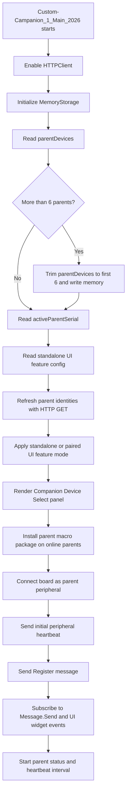
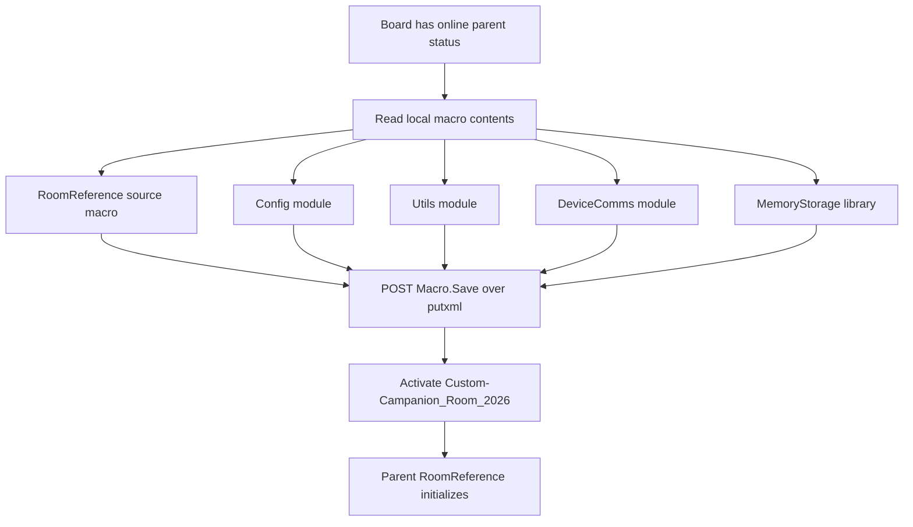
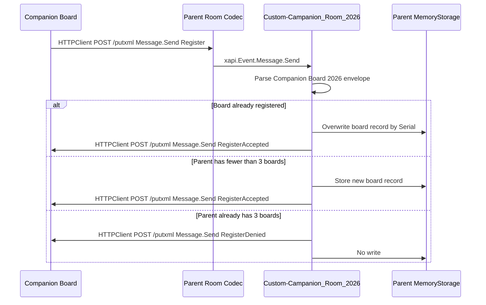
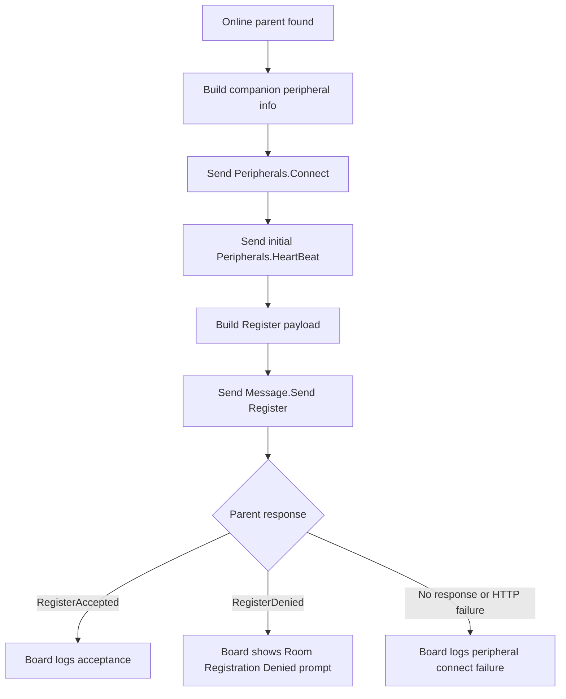
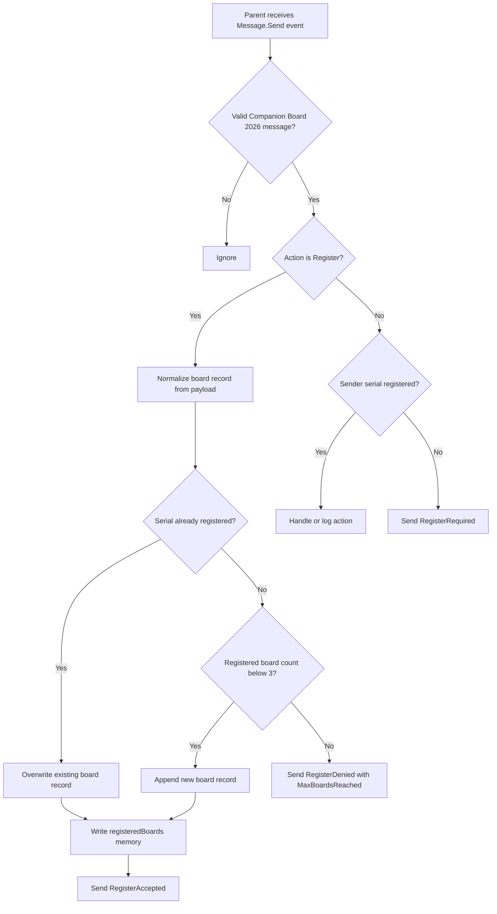
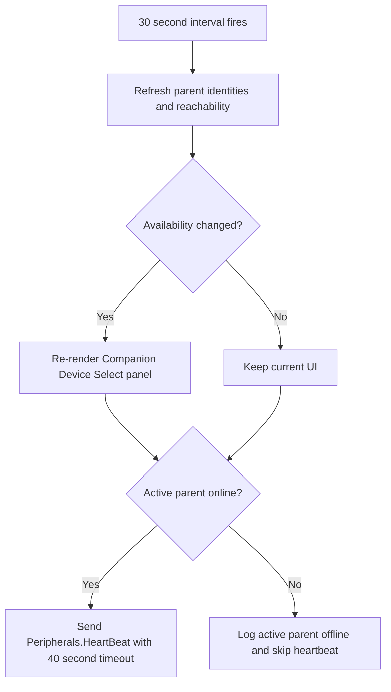
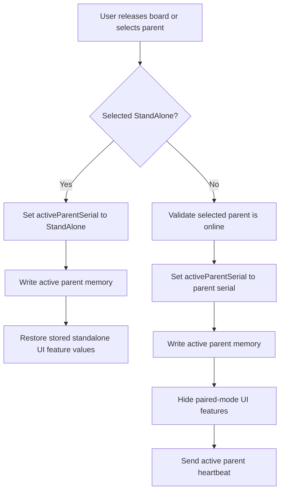

# Custom Companion 2026

Custom Companion 2026 is a Cisco RoomOS macro solution for Board Pro Series endpoints with wheel kits. The solution is intended to let a movable Board Pro be reassigned from room to room and coordinate with a selected parent room device.

## High-Level Scope

- Maintain a board-local list of parent room devices using `Memory-Storage-Functions-V2`.
- Provide a PIN-protected custom UI for adding, validating, confirming, listing, and removing parent devices.
- Initialize and use RoomOS HTTPClient for device-to-device communication.
- Use Message API and putxml-based routing to sanitize and handle custom communication between the movable board and parent room devices.
- Hide base board UI surfaces except whiteboard, files, and solution-owned custom UI elements.
- When a parent room joins a call, instruct the movable board to join the same meeting or call context.
- Keep the board camera muted by default, microphones muted, and volume effectively inaudible while preventing accidental user changes where needed.

## Current Runtime Roles

- Companion board: the movable Board Pro or Board device running `Custom-Campanion_1_Main_2026`.
- Parent room device: the fixed room codec that receives the installed `Custom-Campanion_Room_2026` macro.
- Memory storage: generated state owned by `Memory-Storage-Functions-V2`; this stores board parent-device records and parent registered-board records.
- Transport: RoomOS HTTPClient posts putxml payloads to remote codecs, usually to invoke `Message.Send`, `Peripherals.Connect`, `Peripherals.HeartBeat`, or macro save/activate commands.

## Initialization

The companion board initializes first. It loads local state, validates known parent devices, installs the parent-side macro package, connects itself as a peripheral, and sends a structured `Register` message to each online parent.



## Parent Macro Installation

The board installs the parent-room runtime onto each online parent codec. The installed runtime name is `Custom-Campanion_Room_2026`; helper modules are copied with their numbered source names.



## Codec to Codec Communication

Codec-to-codec commands use the board or parent HTTPClient to post XML to the remote codec `/putxml` endpoint. Custom application messages are carried inside RoomOS `Message.Send` as a JSON envelope.



## Message Envelope

Every custom application message produced by `deviceComms.sendMessageCommand` uses this JSON shape inside `Command.Message.Send`:

```json
{
  "App": "Companion Board 2026",
  "Action": "Register",
  "Serial": "sending device serial",
  "Source": {
	"Role": "Board",
	"Name": "source display name",
	"Host": "source IP or host",
	"MacAddress": "source MAC when known"
  },
  "Payload": {}
}
```

The envelope is intentionally small because RoomOS `Message.Send` text is limited to 8192 characters. Timestamps are left to the macro logs, serial data is only sent once at the top level, and empty `Source` fields are omitted. `Register` is intentionally allowed before the parent recognizes the board serial. Other parent-side custom actions require the sending serial to already exist in the parent `registeredBoards` memory list.

## Board Registration

Registration happens during the current peripheral-connect path. The board first registers itself as a RoomOS peripheral, then sends its Custom Companion application registration data.



The `Register` payload currently includes:

- `Board.Username`
- `Board.Password`
- `Board.ProductPlatform`
- `Capabilities.CanJoinCall`
- `Capabilities.CanMuteAudio`
- `Capabilities.CanMuteVideo`
- `Capabilities.CanReceiveMessages`

## Parent Registration Handling

Each parent codec can store up to 3 registered companion boards. A new registration overwrites an existing board record when the serial matches.



If the parent accepts or denies registration but cannot send the response back to the board with the credentials supplied in the `Register` payload, the parent shows a touch panel prompt: `Companion Registration Error`.

## Parent Selection and Ongoing Heartbeat

The board keeps tracking parent availability and maintains the active parent peripheral heartbeat.



## UI Feature Mode

The board switches between standalone and paired behavior based on the active parent selection.



## Custom Routes and Actions

The current source keeps a small route map in `Custom-Campanion_1_Main_2026`. The new Message API envelope uses `Action`; older route-like names are still listed here because they are defined as solution routes and are expected to be used by future call-control work.

| Route or Action | Direction | Current Status | Purpose |
| --- | --- | --- | --- |
| `Register` | Board to parent | Implemented | Board sends identity, credentials, and capability payload during peripheral connect. |
| `RegisterAccepted` | Parent to board | Implemented | Parent confirms the board is stored or updated in `registeredBoards`. |
| `RegisterDenied` | Parent to board | Implemented | Parent rejects a new board when its 3-board registration limit is reached. |
| `RegisterRequired` | Parent to board | Implemented guard response | Parent receives a non-register action from an unknown serial and asks the board to register first. |
| `parent.heartbeat` | Board to parent | Defined route | Legacy/custom route name reserved for parent heartbeat messaging. Current heartbeat uses `Peripherals.HeartBeat`. |
| `parent.callState` | Parent to board | Defined route | Reserved for parent call-state updates. |
| `board.joinCall` | Parent to board | Defined route | Reserved for instructing the board to join the selected parent call context. |

## Limits and Storage

- One companion board can keep up to 6 parent devices in board memory.
- One parent room codec can register up to 3 companion boards in parent memory.
- Re-registering the same board serial updates that board record instead of consuming another slot.
- `Custom-Campanion-Storage.js` is generated database state and should not be edited or committed as source.

## Notes

`Custom-Campanion-Storage.js` is generated database state managed by the memory storage library and should not be edited or committed as source.
