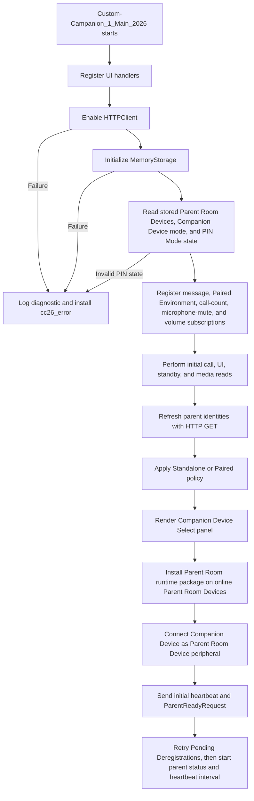
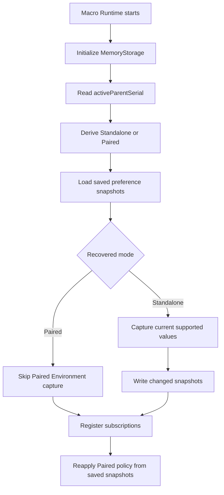
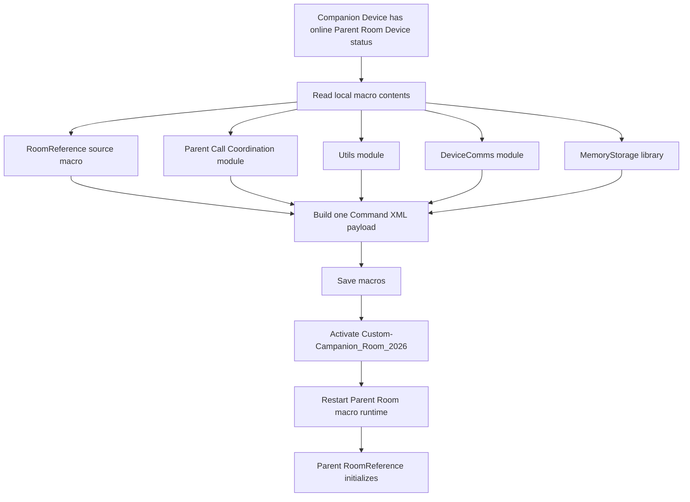
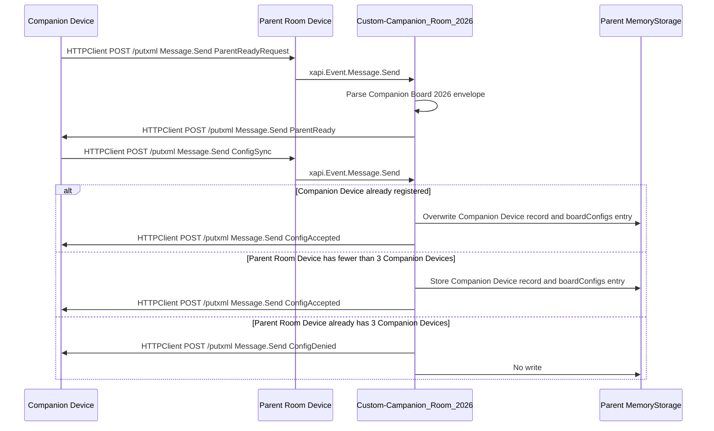
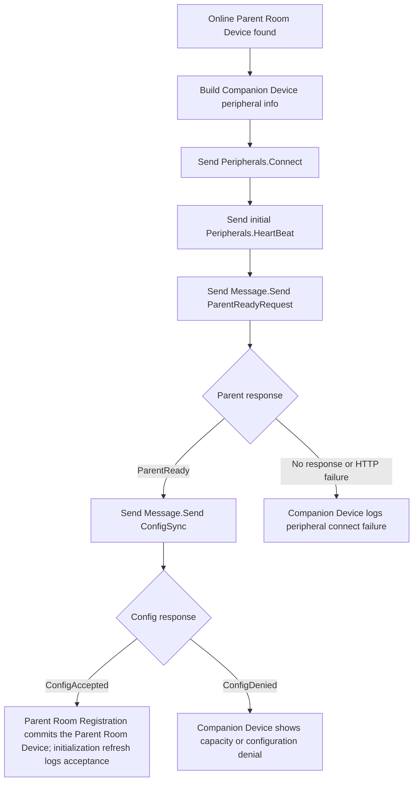
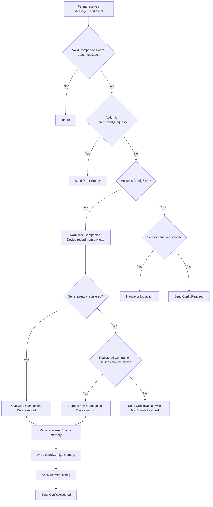
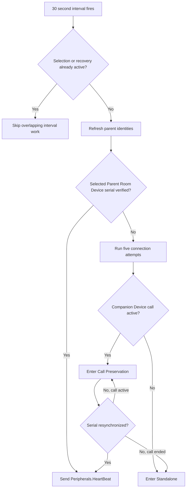
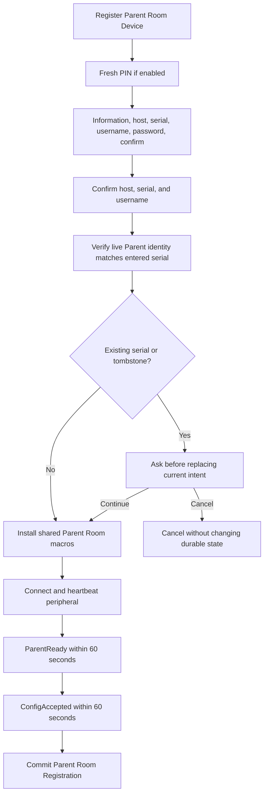
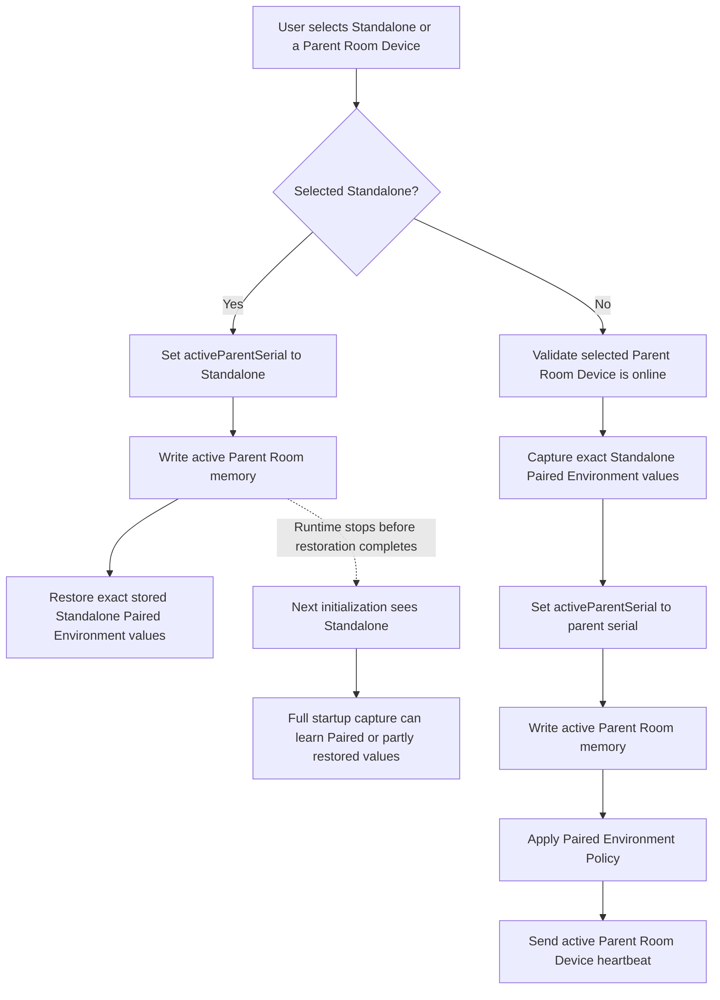

# Custom Companion 2026 Technical Reference

This reference describes the runtime architecture, state ownership, RoomOS xAPI contracts, installer behavior, and current implementation limits. For the project overview, see the [project README](../README.md). For documentation organized by audience, see the [documentation index](README.md).

Custom Companion 2026 is a Cisco RoomOS macro solution for Board Pro Series endpoints with wheel kits. The solution is intended to let a movable Companion Device be reassigned from room to room and coordinate with a selected Parent Room Device.

## High-Level Scope

- Maintain a Companion Device-local list of Parent Room Devices using `Memory-Storage-Functions-V2`.
- Provide PIN-gated Companion Device Select access for Parent Room Registration and Parent Room Deregistration, listing registered Parent Room Devices, selecting an online Parent Room Device, returning the Companion Device to Standalone, and managing PIN Mode from the Config page.
- Initialize and use RoomOS HTTPClient for device-to-device communication.
- Use Message API and putxml-based routing to sanitize and handle custom communication between the Companion Device and Parent Room Devices.
- Apply a reversible Paired Environment Policy that governs known call/share controls, independent discovery and sharing surfaces, and non-camera presentation inputs without overwriting Standalone preferences; native Raise Hand remains subject to device acceptance testing.
- When a Parent Room Device joins a supported Webex call, instruct the Companion Device to join the same call context.
- Keep microphones muted, volume at level 1, and a renewable Do Not Disturb lease active while Paired, while leaving Video Mute available as a user control.

## Current Runtime Roles

- Companion Device: the movable Board Pro Series device running `Custom-Campanion_1_Main_2026`.
- Parent Room Device: the fixed room codec that receives the installed `Custom-Campanion_Room_2026` macro.
- Memory storage: generated state owned by `Memory-Storage-Functions-V2`; this stores Companion Device Parent Room Device records, Pending Deregistration tombstones, Companion Device PIN Mode state, captured Standalone Paired Environment and standby preferences, and Parent Room Registration records.
- Transport: RoomOS HTTPClient posts putxml payloads to remote codecs, usually to invoke `Message.Send`, `Peripherals.Connect`, `Peripherals.HeartBeat`, or macro save/activate commands. Parent Room Device cleanup uses local `Peripherals.Purge`.

## Source Macro Architecture

The deployable source remains unbundled and uses 15 numbered macros. On the Companion Device, only `Custom-Campanion_1_Main_2026` is the active entry macro; its imported modules and the two parent deployment sources remain present under their numbered names. This keeps each stateful workflow independently readable while preserving RoomOS Macro Editor deployment.

| Macro | Responsibility |
| --- | --- |
| `Custom-Campanion_1_Main_2026` | Companion Device entry, initialization order, selection transitions, Unhealthy handling, and cross-controller coordination. |
| `Custom-Campanion_2_Config_2026` | Deployment configuration, including first-initialization `pinMode.defaults`. |
| `Custom-Campanion_3_Utils_2026` | Structured logging and soft/hard diagnostic boundaries. |
| `Custom-Campanion_4_UI_2026` | Access/hidden panel XML, PIN and status prompts, shared Companion Device alert ownership, widget state, and Companion WebWidget adapter. |
| `Custom-Campanion_5_State_2026` | Storage keys, safe MemoryStorage reads, and basic Companion Device mode state. |
| `Custom-Campanion_6_DeviceComms_2026` | HTTP transport, queue policy, Message envelope, putxml builders, and XML parsing. |
| `Custom-Campanion_7_RoomReference_2026` | Inactive Parent Room entry source; installed and activated on a Parent Room Device as `Custom-Campanion_Room_2026`. |
| `Custom-Campanion_8_Services_2026` | Parent package provisioning and runtime Companion Device identity discovery. |
| `Custom-Campanion_9_ParentConnectivity_2026` | Parent identity refresh, retries, heartbeat, recovery, and Call Preservation. |
| `Custom-Campanion_10_PairedEnvironment_2026` | Reversible Paired Environment Policy, WebWidget mode, microphone/volume/DND enforcement, and safe Standalone restoration. |
| `Custom-Campanion_11_BoardCallSync_2026` | Companion Device-side Webex call synchronization, Guest authentication, disconnect, rejoin, retries, and call messaging. |
| `Custom-Campanion_12_ParentCallCoordination_2026` | Parent Room-side call/BYOD detection, participant admission, current-booking Meeting Password lookup, and call-detail responses. |
| `Custom-Campanion_13_StandbyCoordination_2026` | Standalone standby preferences, parent standby sync, delayed application, prompts, and bypass. |
| `Custom-Campanion_14_PinMode_2026` | Companion Device-local PIN state, protected-panel access, edit/disable verification, persistence retry, and inactivity session. |
| `Custom-Campanion_15_ParentRegistration_2026` | Register Parent Room Device wizard, locked provisioning stages, long-hold deregistration, tombstones, and reconciliation. |

No build or bundling step is required for the runtime macros. The Companion Installer installs these source files without changing their runtime boundaries. See [ADR 0001](adr/0001-unbundled-domain-macros.md).

## Source Header Metadata

All 15 deployable source macros use the same metadata rules. `Date Created` records the file's first tracked source date, while `Revised` records its latest content revision. Main, Config, `config.version`, and RoomReference share the four-part project version; each helper or domain macro keeps its own implementation version. Header-only maintenance does not change either version set.

The Documentation field links back to this Technical Reference. Companion Device-only hardware lists follow the Release Manifest, Parent Room-only sources identify their Parent Room Device role, and shared sources identify both deployment roles. AI Generation is an estimate across the accumulated source rather than a line-level measurement. The model is named by stable family because the source spans multiple Codex sessions, and the instruction references point to the tracked project guidance plus the public RoomOS macro guidance instead of a developer-specific local path.

## Companion Installer

The static browser installer in [`installer/`](../installer/) deploys a selected release or the current Main Fork (Beta) snapshot to a Companion Device through JSXAPI. The root [`manifest.json`](../manifest.json) is the Release Manifest and remains authoritative for installable project macros, minimum RoomOS, supported product platforms, and external dependencies. The installer never targets a Parent Room Device directly; the installed Companion Device runtime retains Parent Room provisioning ownership.

After Companion Device configuration and before Review, the installer requires the Device Administrator to choose a Standard Installation or Clean Installation. Standard Installation preserves `Custom-Campanion-Storage`. Clean Installation deactivates the existing project macros, removes only `Custom-Campanion-Storage` when present, and then installs the selected release. This permanently resets the Companion Device's saved Parent Room Devices, Pending Deregistration tombstones, active Parent Room Device selection, PIN Mode state, and captured Standalone Paired Environment and standby preferences. Generated storage remains outside the Release Manifest and is never treated as a Legacy Project Macro.

After a successful initialization, Complete Setup keeps the same authenticated browser session open. It recommends Parent Room Registration from the Companion Device interface and includes an on-device walkthrough. Its optional **Add Parent** browser action can start **Installer Parent Room Registration** zero or more times when a Device Administrator prefers that route. Each browser attempt sends one local, transaction-correlated `Message.Send` request to the Companion Device; the installer never connects to or changes the Parent Room Device itself. The Companion Device runs its registration pipeline and the installer reports only the matching terminal completion or failure result.

Before packaging, `npm run verify:release` checks that the Release Manifest exactly covers the eligible root macros, the runtime project version is synchronized across Main, Config, `config.version`, and RoomReference, every macro passes JavaScript syntax validation, paired `Title` and `Text` fields for RoomOS UserInterface Messages contain no newline characters, relative macro imports resolve to Release Manifest resources, Main still emits the initialization messages used by installer verification, and the deployable source retains the Installer Parent Room Registration action and terminal result identifiers. Installer tests and builds run the same Release Contract verification before generating the pinned source snapshot.

See [`installer/README.md`](../installer/README.md) for local commands and ADR 0002 through ADR 0005 plus ADR 0008 for source selection, credentials, Companion Device Identity Confirmation, forward-only installation, and Installer Parent Room Registration decisions.

## Initialization

The Companion Device initializes first. It registers the UI event routes, initializes HTTPClient and MemoryStorage, loads local state including PIN Mode and Pending Deregistrations, registers call/media subscriptions, validates known Parent Room Devices, applies local mode policy, installs the Parent Room runtime package, connects itself as a peripheral, asks each online Parent Room Device to confirm that the runtime is ready before sending Companion Device-owned configuration, and makes one cleanup attempt for each tombstone. HTTPClient, MemoryStorage, or PIN Mode initialization failure stops initialization, logs a stable administrator diagnostic, removes `cc26_access`, `cc26_hidden`, and legacy `cc26`, and installs the gray widgetless `cc26_error` action panel.



## Durable Memory and Capture Lifecycle

RoomOS configurations persist across device boots and Macro Runtime restarts. Macro variables and subscriptions do not. Custom Companion therefore keeps its own durable runtime state in the generated `Custom-Campanion-Storage` macro through `Memory-Storage-Functions-V2`. A captured configuration record is a **Standalone Preference Snapshot**: an exact value used for later restoration, not a presumed RoomOS default.

Initialization establishes the operating mode before the Paired Environment controller decides whether it may capture values. It initializes MemoryStorage, reads `activeParentSerial`, derives Standalone or Paired, loads the saved snapshots, and only then initializes configuration capture and subscriptions. A recovered Paired mode skips Paired Environment capture and reapplies policy from the saved Standalone Preference Snapshots. A recovered Standalone mode captures the current supported values before continuing.



The Companion Device storage records have different ownership and update rules:

| Record | Owner and write point | Restart purpose |
| --- | --- | --- |
| `parentDevices` | Parent Room Registration commits a verified record; Parent Connectivity may refresh verified identity fields. | Rebuilds the selectable Parent Room Device list and preserves the credentials required for autonomous communication. |
| `pendingDeregistrations` | Parent Room Deregistration writes a tombstone before retiring the selectable record and removes it only after the matching acknowledgement. | Resumes unconfirmed Parent Room Device cleanup. |
| `activeParentSerial` | A verified Parent Room Device selection or transition to Standalone writes the selected operating-mode authority. | Derives Paired or Standalone before Paired Environment capture is considered. |
| `pinMode` | Initialized once from valid configured defaults, then changed only by authorized PIN Mode operations; a failed write is retried once. | Restores the sole runtime authority for PIN Mode. |
| `standaloneUiFeatureConfig` | Captured during a Standalone initialization, immediately before entering Paired, and from supported configuration changes observed while Standalone. It also holds optional original WebWidget restore metadata. | Restores the exact supported Standalone UI feature values. |
| `standalonePairedEnvironmentConfig` | Captured during a Standalone initialization, immediately before entering Paired, and from supported environment changes observed while Standalone. | Restores Mute Warning, the applicable proximity mode, AirPlay and Miracast modes, per-ID non-camera connector presentation selection, and proximity service availability. |
| `standaloneStandbyConfig` | Initializes missing entries from current Standby Control, Halfwake Mode, and Office Hours values, then updates them from changes observed while Standalone. | Restores the exact saved Standalone standby preferences. |

The Parent Room Device has separate generated memory. `registeredBoards` stores its recognized Companion Device records, while `boardConfigs` stores the last accepted Companion Device configuration by serial. `ConfigSync` writes both records; confirmed deregistration removes both. Parent Room initialization reloads them before validation and call coordination begin.

Paired Environment capture follows these mode boundaries:

| Event | Capture or save behavior |
| --- | --- |
| Runtime starts with durable mode Standalone | Fully capture current supported Paired Environment values. |
| A verified Parent Room Device is about to become active | Fully capture while the runtime is still Standalone, then persist the Parent Room Device serial and apply Paired values. |
| A supported value changes while Standalone | Update the corresponding Standalone Preference Snapshot. |
| Runtime starts with durable mode Paired | Do not capture; load the existing snapshots and reapply Paired policy. |
| A supported value changes while Paired | Do not save it as a Standalone preference; reapply Paired policy. |
| The Companion Device returns to Standalone | Fill only previously missing Paired Environment entries, then restore exact saved values. |

The standby snapshot currently has a narrower guard than the Paired Environment snapshots. Existing saved standby entries are never overwritten during initialization, but missing entries are filled from the current device values without first requiring recovered Standalone mode. A Paired restart with an incomplete `standaloneStandbyConfig` can therefore learn a Paired-enforced standby value as the missing Standalone preference. This is a known restart-hardening gap.

A Standard Installation preserves all of these records. A Clean Installation deliberately removes the generated Companion Device storage and therefore removes both the operating-mode authority and every Standalone Preference Snapshot. Because RoomOS configurations themselves persist, a Clean Installation performed while Paired can leave Paired-enforced configuration values on the device; the next initialization has no deleted snapshot from which to recover the earlier Standalone values.

## Parent Room Macro Installation

The Companion Device installs the Parent Room runtime onto each online Parent Room Device. The installed runtime name is `Custom-Campanion_Room_2026`; `Custom-Campanion_12_ParentCallCoordination_2026`, Utils, DeviceComms, and MemoryStorage are copied as dependencies. Only `Custom-Campanion_Room_2026` is activated. Companion Device configuration stays on the Companion Device and is sent later with `ConfigSync`.

The macro save, activate, and runtime restart operations are sent in one putxml command payload. Commands share one `<Command>` root and are grouped under the correct common path nodes; configuration XML is not mixed into this command payload.



## Codec to Codec Communication

Codec-to-codec commands use the Companion Device or Parent Room Device HTTPClient to post XML to the remote codec `/putxml` endpoint. Custom application messages are carried inside RoomOS `Message.Send` as a JSON envelope. DeviceComms is the only HTTPClient call site: it allows three active requests, limits the pending queue to 50, applies an internal three-second timeout, requests `PlainText` response bodies, accepts only HTTP 200–299, and never retries. Equivalent periodic identity, call-status, and heartbeat work is coalesced; all other state-changing commands are admitted FIFO and never coalesced.

DeviceComms parses the RoomOS response XML without external dependencies. The QuickJS-compatible parser supports declarations, comments, elements, self-closing elements, attributes, repeated siblings, text, standard/numeric entities, and CDATA. It rejects malformed XML, document-type/entity declarations, non-2xx responses, `<Error>` elements, and `status="Error"` markers. Administrator diagnostics include stable codes plus method, host, path, status/reason when available, and a bounded response excerpt; credentials and submitted payloads are not logged.

Independent Parent Room Device broadcasts enqueue all registered Companion Device recipients together. The three-Companion Device registration limit therefore fits the transport's three-request concurrency cap without making later recipients wait for earlier network responses. Registration handshakes, storage commits, retries, and other causally dependent operations remain ordered.



## Message Envelope

Every custom application message produced by `deviceComms.sendMessageCommand` uses this JSON shape inside `Command.Message.Send`:

```json
{
  "App": "Companion Board 2026",
	"Action": "ConfigSync",
  "Serial": "sending device serial",
  "Source": {
	"Role": "Board",
	"Name": "source display name",
	"Host": "source IP or host",
	"MacAddress": "source MAC when known"
  },
  "Payload": {}
}
```

The envelope is intentionally small because RoomOS `Message.Send` text is limited to 8192 characters. Timestamps are left to the macro logs, serial data is only sent once at the top level, and empty `Source` fields are omitted. Registration messages carry a `Payload.TransactionId` so stale acknowledgements cannot reverse newer intent. `ParentReadyRequest`, `ConfigSync`, and idempotent `DeregisterRequest` are intentionally allowed before the Parent Room Device recognizes the Companion Device serial. Other Parent Room-side custom actions require the sending serial to already exist in the Parent Room Device's `registeredBoards` memory list.

The legacy `App`, `Source.Role`, `Board`, `CompanionBoardInformation`, `registeredBoards`, `boardConfigs`, capacity/reconciliation payload fields, diagnostic codes, macro filenames, `board.joinCall` route, and `board-device` lab alias remain compatibility identifiers. Product names such as Board Pro and xAPI paths such as `Whiteboard` also remain exact. Human-facing UI, documentation, and logs use Companion Device terminology.

## Companion Device Configuration Handoff

Configuration handoff happens after the parent runtime package is installed and the Companion Device is connected as a RoomOS peripheral. The parent confirms readiness first, then the Companion Device sends an explicit parent-facing subset of Companion Device-owned configuration by custom message. Companion Device-local `pinMode` is never included.



The Register Parent Room Device `ParentReadyRequest` payload includes the runtime Companion Device identity and return path:

- `Board.Serial`
- `Board.Name`
- `Board.Host`
- `Board.Username`
- `Board.Password`
- `Board.MacAddress`
- `Board.ProductPlatform`
- `TransactionId`

Companion Device serial, name, and MAC address are not stored in base config. The Companion Device pulls those values from local xAPI at runtime and places them in the message envelope when needed.

The `ConfigSync` payload currently includes:

- `Config` containing `version`, `CompanionBoardInformation`, `httpClient`, and `UserInterface`; Companion Device-local `pinMode` is excluded
- `Board.Username`
- `Board.Password`
- `Board.ProductPlatform`
- `TransactionId`
- `Capabilities.CanJoinCall`
- `Capabilities.CanMuteAudio`
- `Capabilities.CanMuteVideo`
- `Capabilities.CanReceiveMessages`

## Parent Configuration Handling

Each Parent Room Device can store up to 3 registered Companion Devices. `ConfigSync` saves the Companion Device config into `boardConfigs` by Companion Device serial and updates the `registeredBoards` record. A repeated sync overwrites existing records when the serial matches.

`DeregisterRequest` is accepted whether or not the Companion Device serial is still present, so a lost acknowledgement can be retried safely. The Parent Room Device checks `Status.Peripherals.ConnectedDevice`; when the Companion Device peripheral exists it invokes `Peripherals.Purge` once, and an absent entry is already complete. It then removes the serial from `boardConfigs` and `registeredBoards`, persists both, updates Parent Call Coordination, and sends the transaction-correlated `DeregistrationAccepted`. The installed Parent Room macro package remains active for other registered Companion Devices.



If the Parent Room Device accepts or denies configuration but cannot send the response back to the Companion Device with the credentials supplied by the Companion Device, it shows a touch panel prompt: `Companion Device Registration Error`.

## Parent Selection and Ongoing Heartbeat

The Companion Device keeps tracking Parent Room Device availability and maintains the active Parent Room Device peripheral heartbeat. Releasing a Parent Room Device selection immediately shows a non-interactive `Connecting to Parent Room Device` alert; choosing Standalone shows `Switching to Standalone`. The selection workflow owns that alert until the Standalone transition completes, the Parent Room Device standby decision prompt takes over, the selection fails, or a newer Companion Device alert supersedes it. A 60-second natural expiry prevents a stranded progress alert if the workflow cannot reach normal cleanup. Selecting a Parent Room Device runs a serial-verified identity check with up to five attempts and five seconds between completed failures. `info3` shows `Connecting to {device} — attempt {N} of 5`; publishing that progress and starting the identity read overlap so the UI update does not postpone the network attempt. A successful check does not rebuild the complete Companion Device Select panel unless availability or displayed identity actually changed. A failed selection never restores the previous Parent Room Device: the Companion Device enters Standalone, shows the neutral `Parent Room Device Unavailable` prompt, and displays `Unable to connect to {device}. Running Standalone.` for 60 seconds.

An active Paired Parent Room Device that becomes unavailable follows the same five-attempt path. If the Companion Device has no active call, it enters Standalone. If a call is active, it enters Call Preservation State, keeps the current Parent Room Device assignment and call intact, exposes the native End Call control, and continues one serial-verified network attempt every five seconds. `info3` remains `{device} is temporarily unavailable. Your call will continue.` until communication recovers or the call ends. A matching serial response restores normal Paired controls; a call ending before recovery returns the Companion Device to Standalone.



## PIN Mode and Protected UI

The visible `cc26_access` action panel is saved at `HomeScreenAndCallControls`. It has no pages or widgets. The full existing interface is saved as `cc26_hidden` at `Hidden`; clicking the action panel opens it immediately when PIN Mode is disabled or displays a PIN TextInput first when PIN Mode is enabled. The legacy `cc26` panel is removed during every normal or Unhealthy render so an upgrade cannot leave an unprotected duplicate.

`config.pinMode.defaults.enabled` and `config.pinMode.defaults.pin` initialize one Companion Device-local `pinMode` memory record only when that record does not exist. The durable record is the sole runtime authority afterward. The current PIN is never logged or sent to a Parent Room Device. PIN Mode is an in-room access gate rather than device authentication; a Device Administrator with Macro Editor or generated-storage access can inspect or change the underlying source/state. PINs are constrained in `Custom-Campanion_14_PinMode_2026` to 4-8 numeric digits so Device Administrators only configure the two bootstrap values.

Turning PIN Mode on writes the state, updates the On/Off widget feedback, closes the hidden panel, and shows a dismissible 15-second confirmation. Turning it off requires the current PIN, leaves the panel open after success, and shows a 15-second confirmation. Editing always verifies the current PIN, collects and confirms the new PIN, and only writes after both entries match. Incorrect verification re-prompts without a lockout; invalid or mismatched edit input explains the failure and restarts at current-PIN verification. Dismissal or expiry cancels the active attempt.

The protected UI session closes after 60 seconds of inactivity. Opening the launcher, opening or changing a protected page, any widget action within `cc26_hidden`, and PIN/registration stage display or response reset the timer. RoomOS exposes only the final TextInput response—not individual keypad presses—so typing a digit cannot reset the timer. Expiry clears the active PIN input or naturally expires a 60-second registration input, discards unsaved input, and closes the protected panel.

Parent Room Registration and Parent Room Deregistration each require a fresh current-PIN authorization when PIN Mode is enabled, even when the protected panel is already open. The authorization is scoped to that one operation; incorrect input re-prompts, while dismissal or expiry cancels it.

## Parent Room Registration and Deregistration

After installation, Complete Setup offers an optional **Add Parent** modal. A Device Administrator may use it zero or more times instead of the in-room wizard, or leave Parent Room Registration for the Companion Device interface. The browser form collects the Parent Room Device host, expected serial, and credentials, then sends the local `InstallerParentRegistrationRequest` action to the authenticated Companion Device. The Companion Device verifies that the request names itself, performs the same live Parent Room Device serial confirmation and provisioning stages, and reports a transaction-correlated terminal result through its macro log. The in-room UI remains unchanged and PIN Mode is not displayed or requested for this Device Administrator workflow. If the verified Parent Room Device is already registered or has a Pending Deregistration, the installer requires an explicit replacement acknowledgement before the Companion Device makes the new registration the current intent.

`Register Parent Room Device` collects host, expected Parent Room Device serial, username, password, and password confirmation after an information page. Host input must be a DNS host name, IPv4 address, or bracketed IPv6 address without a scheme or path; serial input accepts letters and numbers with optional spaces or hyphens; and usernames accept the RoomOS-safe letters, numbers, period, underscore, hyphen, and `@` characters. Invalid values re-open the same input step instead of advancing. The registration confirmation shows the normalized host, serial, and username in one semicolon-separated line but never the password; RoomOS UserInterface Message `Title` and `Text` fields do not use newline characters. If RoomOS rejects the confirmation display, the candidate password is discarded and password entry is re-opened with recovery guidance. The final Register Device choice begins a locked workflow: the hidden panel closes, a zero-duration progress prompt remains on screen, selecting its waiting option reopens the same stage, and `Prompt.Cleared` also reopens it. Each visible stage owns a fresh 60-second watchdog. The final success or failure prompt lasts up to 60 seconds.

The locked stages authenticate to the host, read its live identity, and require the observed serial to match the entered serial before any Parent Room macro changes. A mismatch reports failure without displaying the observed serial. After identity confirmation, the workflow asks before replacing an existing serial or canceling that serial's Pending Deregistration, installs/starts the shared Parent Room macros, connects and heartbeats the Companion Device peripheral, waits for `ParentReady`, waits for `ConfigAccepted`, and finally saves the Parent Room Device record. `ParentReadyRequest` and `ConfigSync` retry every five seconds only inside their respective 60-second stages. The candidate credentials stay transient until the Parent Room Device accepts and the Companion Device storage write succeeds. A new serial is rejected when the Companion Device already has six registered Parent Room Devices; a Parent Room Device rejects a new Companion Device when it already has three. Registration is blocked only while the Companion Device is Paired and in an active call. A Standalone call does not block it.

If the verified serial already exists, the Companion Device asks whether to overwrite the saved name, host, and credentials. If the serial has a Pending Deregistration tombstone, it asks whether the user wants to make registration the newer intent. Decline keeps the existing state. Acceptance suppresses cleanup retries for that serial while the complete registration handshake is in progress, preventing the older removal intent from racing the new registration. Only `ConfigAccepted` plus the local registration write replaces the old record or tombstone. A failure does not create a selectable Parent Room Registration. If configuration may already have reached the Parent, the Companion Device retains only a hidden cleanup tombstone and tells the user to inspect macro logs.

Pressing and holding any online or offline Parent Room Device button for three seconds displays Deregister Parent Room Device. A fresh PIN is required after confirmation when PIN Mode is enabled. The Parent Room Device disappears from Companion Device Select immediately after durable local retirement. If it was active, the Companion Device cancels call rejoin, ends every local Companion Device call, enters Standalone, and informs the user before confirmation that the call remains active on the Parent Room Device. The shared Parent Room macros are never uninstalled because other Companion Devices may rely on them.

After durable local retirement, deregistration enters a locked `Confirming Parent Room Deregistration` stage. `DeregisterRequest` retries every five seconds during that 60-second stage. `Parent Room Device Deregistered` appears only after the matching `DeregistrationAccepted` confirms that both devices completed removal. If the stage expires or transport fails, `Parent Room Deregistration Pending` explains that the Parent Room Device is already gone from the Companion Device but remote cleanup remains unconfirmed. A later matching acknowledgement replaces that notice with confirmed success.

The hidden `pendingDeregistrations` record retains the Parent Room Device serial and connection data until a matching `DeregistrationAccepted` transaction arrives. The Parent Room Device purges the Companion Device's `Peripherals ConnectedDevice` entry, removes `registeredBoards` and `boardConfigs`, and only then acknowledges. An already-absent peripheral counts as complete. Cleanup is attempted during the locked Parent Room Deregistration stage, at Companion Device initialization, and whenever a valid message arrives from that pending Parent Room Device. Parent Room Device initialization sends `RegistrationValidation` to its saved Companion Devices; an active registration replies `RegistrationValidated`, while a Pending Deregistration immediately retries `DeregisterRequest`. Messages from unknown or retired Parent Room Devices are otherwise ignored. See [ADR 0006](adr/0006-parent-registration-and-tombstone-reconciliation.md).



## Paired Environment Policy

The Companion Device switches between Standalone and Paired behavior based on the active Parent Room Device selection.

`config.UserInterface.WebWidget.CompanionWidget.enabled` is `true` by default. The Companion Device reads the current Web Widget from `Status.UserInterface.WebView` and saves its URL and restore metadata once into memory. By default, Companion Widget is shown in both Standalone and Paired modes; set `config.UserInterface.WebWidget.CompanionWidget.restoreStandaloneExisting` to `true` to restore the original Web Widget when running Standalone. In Paired mode, the Companion Device removes its own Companion widget when needed with `UserInterface.Extensions.WebWidget.Remove`, then saves the built-in Simple-WebWidget URL with hash parameters unless `config.UserInterface.WebWidget.urlOverride` is supplied. Configurable CompanionWidget hash fields include weather.mode, weather.latitude, weather.longitude, weather.temperatureUnit, time.mode, time.timeZone, `Standalone.info2`, `Standalone.iconUrl`, `Paired.info2`, and `Paired.iconUrl`. The Companion Device supplies theme, heading, info1, solution-owned runtime `info3`, and `hideSettings=true` in code, and re-saves the widget if `UserInterface Theme Name` changes.

Standalone standby preferences are saved in Companion Device memory for `Standby Control`, `Standby Halfwake Mode`, and `Time OfficeHours Enabled`. In Paired mode, the Companion Device forces those values to `Off`, `Manual`, and `False` so it does not enter standby independently. When a Parent Room Device is selected, the Companion Device clears any earlier standby sync or bypass state and begins reading that serial-verified Parent Room Device's current `Status.Standby.State` while the required local Paired policy is applied. The fetched state is discarded if the selection or mode changes, and the prompt is not shown if required Paired safety enters the Unhealthy State. After safety succeeds, the Companion Device shows one stable 30-second prompt before applying `Off`, `Standby`, or `Halfwake`. An idle `ActiveCallDetails` response or `Disconnect` message does not cancel this decision window; Network, BYOD, admission, or active `ActiveCallDetails` state does. Standby updates received during the decision window replace the pending state without moving the original deadline. Externally dismissing or displacing the prompt ends only its visible lifecycle: the prompt is not redisplayed, and the latest valid Parent Room Device state is still applied at the original deadline. Parent Room Devices also subscribe to `Status.Standby.State` and send debounced `StandbySync` messages to registered Companion Devices; after the initial decision window, the Companion Device follows those active-Parent Room Device standby commands immediately without showing a prompt. The Companion Device ignores `EnteringStandby`. A user can start 5-minute or 30-minute bypass windows; while bypass is active, Parent Room Device standby commands are ignored and the Web Widget `info3` shows `Standby sync bypass until HH:MM AM/PM`. Explicit Dismiss hides the prompt while retaining the pending action. Runtime `info3` precedence is Unhealthy State, Parent Connectivity/Call Preservation, call synchronization, then standby. The WebWidget adapter limits `info3` to 90 characters and, when needed, trims at a word boundary with an ellipsis so dynamic status text cannot run beneath the fixed footer.

The reversible Paired Environment Policy is owned by `Custom-Campanion_10_PairedEnvironment_2026`. Immediately before a verified Parent Room Device selection changes the runtime from Standalone to Paired, the controller reads every supported governed configuration and stores the exact Standalone values in Companion Device memory. Configuration subscriptions update those preferences only while the Companion Device is actually Standalone. Returning to Standalone restores only exact saved values. An optional path or connector that is unsupported, absent, or missing a durable Standalone value is logged and left unchanged; this is especially important when a release first starts on a device that was already Paired.

On a steady-state Paired Macro Runtime restart, Main loads `activeParentSerial` and both Paired Environment snapshots before initialization reaches the capture gate. The recovered Paired mode skips capture, and `captureStandaloneConfig` also rejects direct calls unless the current mode is Standalone. Paired subscription events reapply policy rather than updating either Standalone Preference Snapshot.

The UI feature slice sets Video Mute, Participant List, and Whiteboard Start to `Auto`; the other known call controls plus Share Start are set to `Hidden`, and `BYOD.QRCodePairing` is set to `Disabled`. Call End is `Hidden` during normal Paired operation and temporarily `Auto` during Call Preservation or an active-call Unhealthy State. Unsupported optional feature paths are logged and skipped. Because RoomOS does not expose a dedicated Raise Hand visibility configuration, device acceptance must confirm Raise Hand remains available with MidCallControls hidden.

The remaining Paired configuration slice sets `UserInterface.MuteWarning = Disabled`, `Video.Input.AirPlay.Mode = Off`, and `Video.Input.Miracast.Mode = Off`. `Config.Provisioning.Mode` selects exactly one proximity alternative: `Webex.Proximity.Mode = Off` when its value is `Webex`, otherwise `Proximity.Mode = Off`; the controller never blindly sets both. AirPlay and Miracast `PresentationSelection` remain unchanged because those sharing modes are disabled completely.

The controller reads the complete `Config.Video.Input.Connector` collection and normalizes it into connector records using each RoomOS `id`. It treats only an exact case-insensitive `InputSourceType = camera` as a camera. Every other supported connector retains a separate saved `PresentationSelection` value keyed by connector ID and is set to `Manual` while Paired. Camera connectors are never changed, unavailable `PresentationSelection` paths are skipped, absent saved connectors are ignored during restoration, and a newly discovered connector is not changed while Paired until its own value has been observed in Standalone.

When a governed Standalone snapshot exists, entering Paired also invokes `Command.Proximity.Services.Deactivate()` once. Returning to Standalone restores the selected proximity configuration before invoking `Command.Proximity.Services.Activate()` only when the pre-Paired `Status.Proximity.Services.Availability` was exactly `Available`; an original `Disabled` or `Deactivated` state remains inactive. The policy intentionally leaves `UserInterface.Whiteboard.ShareInCall`, `UserInterface.LiveAnnotation.Enabled`, `Conference.JoinLeaveNotifications`, `Webex.Meetings.MeetingChatNotifications.Mode`, `Audio.Ultrasound.MaxVolume`, people-presence, occupancy, and motion-wake configurations unchanged.

While Paired, the Companion Device performs initial reads and subscribes to `Status.Audio.Microphones.Mute` and `Status.Audio.Volume`. An observed unmute invokes `Command.Audio.Microphones.Mute` once; a volume other than 1 invokes `Command.Audio.Volume.Set` once with `Level: 1` and no `Device` parameter. The Companion Device also invokes `Command.Conference.DoNotDisturb.Activate({ Timeout: 5 })` and renews that solution-owned lease every two minutes so incoming calls are rejected. Entering Standalone clears the renewal timer and invokes `Command.Conference.DoNotDisturb.Deactivate()`; a DND state that predated Paired mode is intentionally not restored. These local commands are not retried. Leaving Paired keeps the microphone state muted. If no call is active, the Companion Device immediately reads `Config.Audio.DefaultVolume`, restores that value, and reminds the user to unmute. If a call is active, the Companion Device enters Standalone immediately and asks whether to restore volume; decline, dismissal, or prompt failure leaves the level unchanged.

The Paired Companion Device participates in at most one call. DND blocks ordinary incoming calls, and a new Parent Room Device call join request is ignored whenever `Status.SystemUnit.State.NumberOfActiveCalls` shows an existing call. Every synchronized `Webex.Join` explicitly uses `ParticipantRole: Guest`. The Companion Device reads and subscribes to the conference authentication request: it answers Guest-capable role selection immediately, including the Guest choice in combined role-and-PIN requests. After an accepted combined request, the Companion Device allows the native authentication UI 250 milliseconds to settle and then begins password lookup unless the authentication request or call changed. If RoomOS requires that combined request to include the PIN, the rejected role-only response falls through to the same password lookup rather than failing the authentication workflow. The Companion Device asks only its active Parent Room Device for a Meeting Password when Guest authentication requires one. The Parent Room Device performs one current `Bookings.List` read and returns a password only when exactly one booking is current, matches the active Parent Room Device call identity, and contains a password. The password remains transient and is never stored or written to macro logs. An unavailable, ambiguous, stale, or unmatched password leaves native manual entry available and displays `Enter the meeting password manually on this Companion Device.` in both Infoblock 3 and a duration-0 alert. If the call drops during authentication while the Parent Room Device is still connected, the Companion Device immediately requests authoritative Parent Room Device call state and rejoins the active Webex call.

If an In-Room User starts a call directly from the Paired Companion Device without current Parent Room Device authorization, reconciliation displays `Start calls from the Parent Room Device.` in Infoblock 3 and its RoomOS alert before attempting the disconnect so guidance does not wait for call-command completion. Both notices last 15 seconds. The alert retains the title `Start Calls from Parent Room Device` and the detailed text `Calling is available through the Parent Room Device while this Companion Device is Paired. Start the call from the Parent Room Device, or run this Companion Device as Standalone to call directly.` An authorized Parent Room Device call or a transition away from Paired dismisses both notices early, and the macro log records that Paired calls must start from the Parent Room Device together with both guidance forms and the notice duration. Companion Device alerts share one ownership path because RoomOS `Alert.Clear` is global: every display claims a stable workflow owner, a newer display invalidates the former owner, and an early clear is sent only while the requesting owner and token are still current. Natural duration expiry relinquishes ownership without another clear. When an active Parent Room Device call uses another platform, Infoblock 3 displays `[Platform] isn't supported. Start a Webex call from the Parent Room Device.` before any stale Companion Device call is disconnected. Standalone retains native RoomOS call behavior.



The dashed path is a current source-level restart limitation, not a device-validated failure. A steady-state Paired restart is protected, but the Paired-to-Standalone transition persists `activeParentSerial = Standalone` immediately before restoring the Paired Environment and standby snapshots. If the Macro Runtime stops after that durable write but before restoration finishes, the next initialization trusts Standalone mode and may overwrite saved preferences with Paired-enforced or partially restored current values.

The recommended hardening direction is to make the durable Standalone mode write the commit point rather than the first restoration step. The runtime can switch its in-memory context to Standalone, restore the Paired Environment and standby snapshots under their existing apply guards, and write `activeParentSerial = Standalone` only after those restorations succeed. A restart before that final write would recover Paired and idempotently reapply Paired policy without changing the snapshots; a restart after it would observe already-restored Standalone configurations. The standby controller should also require Standalone mode before learning missing snapshot entries and defer Paired enforcement for any standby path without a saved Standalone value. A write-ahead transition marker could preserve the user's intent to finish entering Standalone after a restart, but it adds another durable state machine and is not required merely to protect the snapshots. None of this hardening is implemented yet.

## Unhealthy State and Administrator Communication

Required local prerequisite failures, invalid saved PIN Mode state, and required Paired microphone/volume/DND enforcement failures enter an Unhealthy State. The console logs a stable code, component, context, remediation, and original error without credentials or PIN values. The `cc26_access` and `cc26_hidden` panels are replaced by the gray widgetless `cc26_error` action panel, blocking Parent Room Device selection. Clicking it shows `Contact a Device Administrator.` for up to 30 seconds with a Dismiss option. When the managed Companion Web Widget is available, solution-owned Infoblock 3 persistently shows `Companion Device controls are unavailable. Contact a Device Administrator.` Recovery requires correcting the local macro/xAPI issue and restarting the Macro Runtime; no background initialization retry or self-restart is attempted.

If saved PIN Mode state is malformed, initialization first replaces it with the configured defaults. If the configured default PIN is also invalid, the built-in recovery PIN `0000` is used. Initialization then raises a hard error and remains stopped so a Device Administrator can inspect the diagnostic before restarting. A failed PIN Mode memory write is retried once after two seconds; a second failure enters the Unhealthy State.

If required media enforcement fails during an active call, the Companion Device remains assigned, exposes End Call, and leaves the call, microphone, and volume unchanged. When the call ends it enters Standalone, attempts the now-safe default-volume restoration once, and remains Unhealthy until restart.

## Runtime Log Severity

Runtime logs separate administrator-relevant state changes from routine monitoring:

- `debug` is the default for periodic or subscription-driven monitoring, including heartbeat results, Do Not Disturb lease activity, call-state reconciliation, standby synchronization, admission polling, raw HTTP responses, no-op decisions, and repeated enforcement success.
- `info` records bounded lifecycle or workflow milestones such as initialization, Paired or Standalone transitions, registration completion, call join/disconnect decisions, and restored Parent Connectivity.
- `warn` records a recoverable condition that changes or blocks expected behavior and needs administrator attention. Periodic monitor failures remain `debug` when a higher-level state transition or workflow result already makes the degradation visible.
- `error` records initialization stops, Unhealthy State entry, failed required local enforcement, and other conditions that need remediation before normal operation can resume.

Logs keep stable diagnostic codes and compatibility field names where those values are machine-facing. Human-readable messages use `Companion Device`, `Parent Room Device`, and `Standalone`.

## Explicit RoomOS xAPI Contracts

| Purpose | Initial read or command | Subscription |
| --- | --- | --- |
| Local call safety | `xapi.Status.SystemUnit.State.NumberOfActiveCalls.get()` | `xapi.Status.SystemUnit.State.NumberOfActiveCalls.on(...)` |
| Guest meeting authentication | `xapi.Status.Conference.Call.AuthenticationRequest.get()`, `xapi.Command.Conference.Call.AuthenticationResponse({ ParticipantRole: 'Guest', ... })`, and Parent-local `xapi.Command.Bookings.List({ ScheduleType: 'Current', Limit: 20 })` when a Guest password is required | `xapi.Status.Conference.Call.AuthenticationRequest.on(...)` |
| Companion Device alerts | Shared UI ownership around `xapi.Command.UserInterface.Message.Alert.Display(...)` and the global `.Alert.Clear()`; a clear is attempted once only for the current owner/token | Duration expiry relinquishes ownership locally without another xAPI clear |
| Paired microphone enforcement | `xapi.Status.Audio.Microphones.Mute.get()` and `xapi.Command.Audio.Microphones.Mute()` | `xapi.Status.Audio.Microphones.Mute.on(...)` |
| Paired volume enforcement | `xapi.Status.Audio.Volume.get()` and `xapi.Command.Audio.Volume.Set({ Level: 1 })` | `xapi.Status.Audio.Volume.on(...)` |
| Paired incoming-call isolation | `xapi.Command.Conference.DoNotDisturb.Activate({ Timeout: 5 })` and `.Deactivate()` | Two-minute solution timer renews the five-minute lease while Paired |
| Paired reversible configurations | `xapi.Config.Provisioning.Mode.get()` plus exact gets/sets for the governed UI, proximity, AirPlay, and Miracast paths | Each supported governed config path; values are learned only while Standalone |
| Paired connector presentation policy | `xapi.Config.Video.Input.Connector.get()` and supported `Connector[id].PresentationSelection.set(...)` calls | `xapi.Config.Video.Input.Connector.on(...)` plus supported per-connector `InputSourceType` and `PresentationSelection` subscriptions |
| Paired proximity service isolation | `xapi.Status.Proximity.Services.Availability.get()` and `xapi.Command.Proximity.Services.Deactivate()/Activate()` | `xapi.Status.Proximity.Services.Availability.on(...)`; Standalone activation requires the saved value `Available` |
| Standalone volume restoration | `xapi.Config.Audio.DefaultVolume.get()` and `xapi.Command.Audio.Volume.Set({ Level })` | None; current default is read during the Standalone transition |
| Error action button | `xapi.Command.UserInterface.Extensions.Panel.Save/Remove` | `xapi.Event.UserInterface.Extensions.Panel.Clicked.on(...)`, gated to `cc26_error` |
| PIN-gated panel access | `xapi.Command.UserInterface.Extensions.Panel.Save(...)`, `xapi.Command.UserInterface.Extensions.Panel.Open(...)`, `xapi.Command.UserInterface.Extensions.Panel.Close()`, `xapi.Command.UserInterface.Extensions.Panel.Remove(...)`, `xapi.Command.UserInterface.Message.TextInput.Display(...)`, `xapi.Command.UserInterface.Message.TextInput.Clear(...)`, and `xapi.Command.UserInterface.Extensions.Widget.SetValue(...)` | `xapi.Event.UserInterface.Extensions.Panel.Clicked.on(...)`, `xapi.Event.UserInterface.Extensions.Widget.Action.on(...)`, `xapi.Event.UserInterface.Message.TextInput.Response.on(...)`, `xapi.Event.UserInterface.Extensions.Event.PageOpened.on(...)`, and `xapi.Event.UserInterface.Extensions.Event.PageClosed.on(...)` |
| Registration modal enforcement | `xapi.Command.UserInterface.Message.Prompt.Display/Clear` and `TextInput.Display` | `xapi.Event.UserInterface.Message.Prompt.Response/Cleared`, `TextInput.Response/Clear`, and `Extensions.Widget.Action` |
| Parent peripheral cleanup | Parent-local `xapi.Status.Peripherals.ConnectedDevice.get()` and one `xapi.Command.Peripherals.Purge({ ID })` when present | Reconciliation is message/initialization driven; local purge is not retried inside one request |
| Parent identity | `xapi.Command.HttpClient.Get` for `/getxml?location=/Status/SystemUnit` | Five-second workflow retries; no HTTP transport retry |
| Parent standby | `xapi.Command.HttpClient.Get` for `/getxml?location=/Status/Standby/State` | Parent `xapi.Status.Standby.State.on(...)` sends `StandbySync` |
| Companion Device call validation | `xapi.Command.HttpClient.Get` for `/getxml?location=/Status/Call` | Parent admission workflow invokes the queued read |
| Remote commands/messages | `xapi.Command.HttpClient.Post` to `/putxml` | Remote `xapi.Event.Message.Send.on(...)` receives Custom Companion envelopes |

## Custom Routes and Actions

The current source keeps a small route map in `Custom-Campanion_1_Main_2026`. The new Message API envelope uses `Action`; older route-like names are still listed here because they are defined as solution routes and are expected to be used by future call-control work.

| Route or Action | Direction | Current Status | Purpose |
| --- | --- | --- | --- |
| `InstallerParentRegistrationRequest` | Companion Installer to Companion Device | Implemented, Device Administrator workflow | A local browser JSXAPI `Message.Send` request starts the Companion Device-owned Parent Room Registration pipeline without rendering the in-room wizard. The request carries a transaction ID, Parent Room Device details, and explicit replacement acknowledgement. |
| `ParentReadyRequest` | Companion Device to Parent Room Device | Implemented | The Companion Device asks the freshly installed Parent Room runtime to confirm it is ready and provides return-path credentials. |
| `ParentReady` | Parent Room Device to Companion Device | Implemented | The Parent Room Device confirms the runtime is active and ready to receive Companion Device-owned configuration. |
| `ConfigSync` | Companion Device to Parent Room Device | Implemented | The Companion Device sends the explicit Parent Room-facing config subset, return credentials, and capabilities. Companion Device-local `pinMode` is excluded. |
| `ConfigAccepted` | Parent Room Device to Companion Device | Implemented | The Parent Room Device confirms config was stored in `boardConfigs` and Companion Device identity was stored or updated in `registeredBoards`. |
| `ConfigDenied` | Parent Room Device to Companion Device | Implemented | The Parent Room Device rejects config from a new Companion Device when its three-device registration limit is reached. |
| `ConfigRequired` | Parent Room Device to Companion Device | Implemented guard response | The Parent Room Device receives an unsupported action from an unknown Companion Device serial and asks the Companion Device to send config first. |
| `RegistrationValidation` | Parent Room Device to Companion Device | Implemented | Parent Room runtime initialization asks each saved Companion Device to prove whether the Parent Room Registration is still current. |
| `RegistrationValidated` | Companion Device to Parent Room Device | Implemented | A Companion Device with an active registration confirms the Parent Room Device record; a tombstoned Companion Device sends deregistration instead. |
| `DeregisterRequest` | Companion Device to Parent Room Device | Implemented, idempotent | The Companion Device asks the Parent Room Device to purge its peripheral and remove this Companion Device's config/registration records. |
| `DeregistrationAccepted` | Parent Room Device to Companion Device | Implemented | The Parent Room Device confirms all three cleanup steps; the matching transaction removes the Companion Device tombstone. |
| `StandbySync` | Parent Room Device to Companion Device | Implemented | The Parent Room Device sends its debounced standby state to registered Companion Devices; each Companion Device acts only when the sending Parent Room Device serial matches its active Parent Room Device. |
| `CallSync` | Parent Room Device to Companion Device | Webex-only join/disconnect slice | The Parent Room Device detects new calls and also reads current call state when its runtime initializes, carrying the Webex meeting invite link when available and falling back through current call identities. Companion Device initialization, Parent Room Device selection, configuration acceptance, local call loss, and a ten-second active-call check request authoritative Parent Room Device state. A matching existing Companion Device call is adopted; an unrelated or unauthorized Paired Companion Device call is disconnected; an idle Companion Device joins the current Parent Room Device Webex meeting explicitly as Guest. A failed periodic network check preserves a previously authorized call. Webex join and disconnect xAPI commands remain single-attempt. Call identity comparison trims and lowercases each value, then ignores any prefix through the first `:`. Host and cohost roles on the Parent Room Device can admit exact-name registered waiting Companion Devices after exact call-identity validation or, when scheduled-meeting identities differ, validation that both devices are in Webex calls. Distinct waiting Companion Devices are processed concurrently, while per-participant in-flight ownership prevents duplicate admission. Unsupported Zoom, Microsoft Teams, Google Meet, SIP/H.323 bridge, and BYOD calls do not auto-join and use generic `info3` guidance to have the Parent Room Device join a Webex call. |
| `ActiveCallDetailsRequest` | Companion Device to Parent Room Device | Implemented | The Companion Device requests the active Parent Room Device's freshly read call state for Paired transitions, initialization, periodic authorization, orphan cleanup, and same-call rejoin decisions. |
| `MeetingPasswordRequest` | Companion Device to Parent Room Device | Implemented, transient | A registered Companion Device asks only its active Parent Room Device to resolve a Meeting Password for the current Guest authentication request. |
| `MeetingPasswordResponse` | Parent Room Device to Companion Device | Implemented, transient | The Parent Room Device returns the correlated best-effort result of one current-booking lookup. The Companion Device rejects stale, wrong-parent, wrong-request, and inactive-call responses. |
| `parent.callState` | Parent Room Device to Companion Device | Defined route | Reserved for Parent Room Device call-state updates. |
| `board.joinCall` | Parent Room Device to Companion Device | Defined route | Reserved compatibility identifier for instructing the Companion Device to join the selected Parent Room Device call context. |

## Limits and Storage

- One Companion Device can keep up to 6 Parent Room Devices in Companion Device memory.
- One Parent Room Device can register up to 3 Companion Devices in Parent Room Device memory.
- Re-syncing the same Companion Device serial updates that Companion Device record and its `boardConfigs` entry instead of consuming another slot.
- Re-registering an existing serial requires explicit overwrite confirmation and does not consume another Companion Device or Parent Room Device slot.
- `pendingDeregistrations` entries are not selectable Parent Room Devices; they retain connection credentials only until Parent Room Deregistration cleanup is explicitly acknowledged.
- `Custom-Campanion-Storage.js` is generated database state and should not be edited or committed as source.

## Notes

`Custom-Campanion-Storage.js` is generated database state managed by the memory storage library and should not be edited or committed as source. The Companion Installer preserves it during a Standard Installation and removes it only when a Device Administrator explicitly selects Clean Installation.
