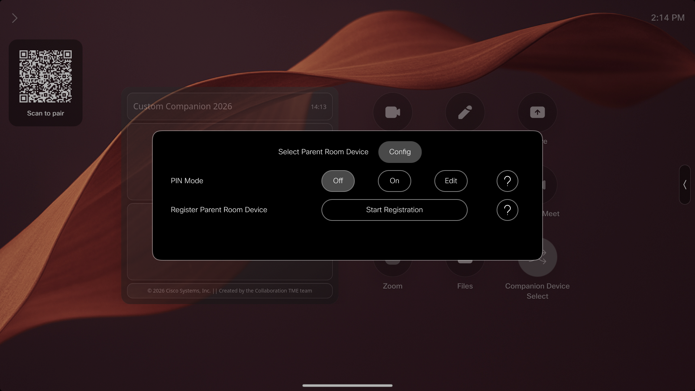
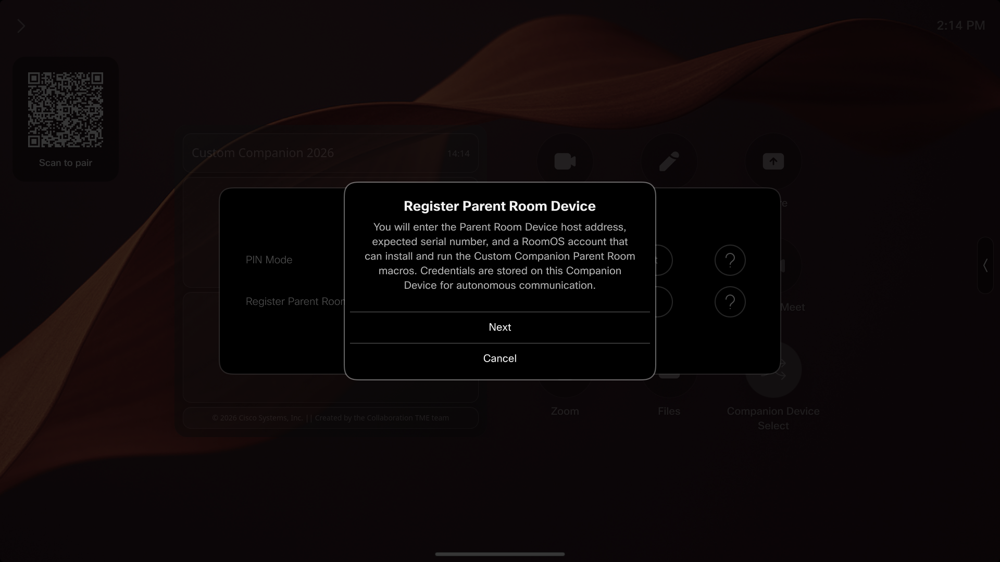
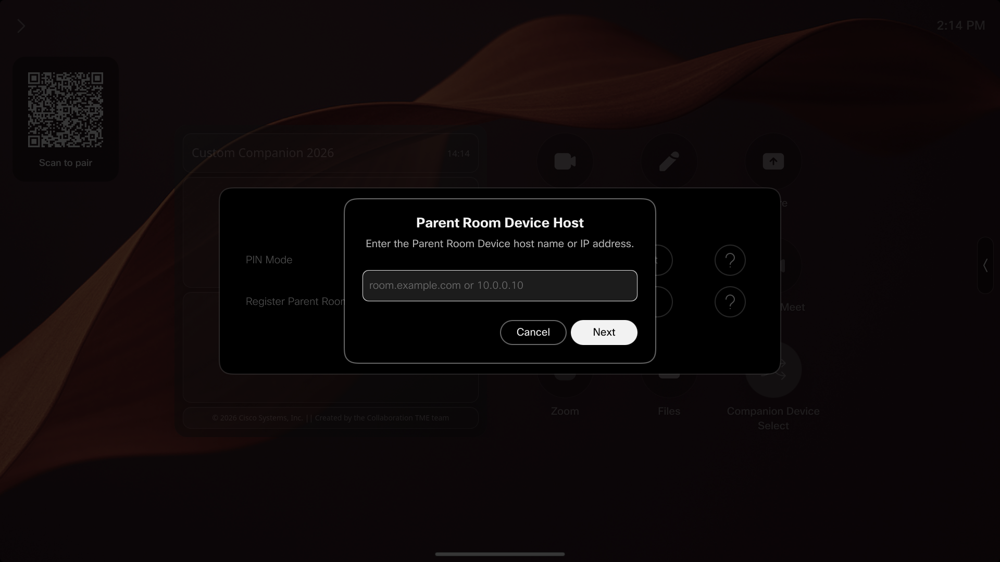
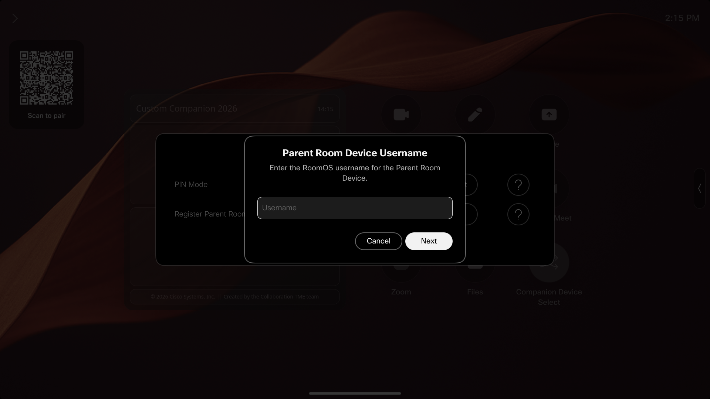

# Custom Companion User Guide

This guide explains how to operate Custom Companion from the Companion Device touch interface. It is written for In-Room Users; installation, account creation, and technical recovery should be handled by a Device Administrator.

Screen appearance can vary slightly by RoomOS version and theme, but the control names and workflows below match the current Custom Companion macros.

## Understand the devices and operating modes

A **Companion Device** is the movable RoomOS device running Custom Companion. A **Parent Room Device** is a fixed room system that has been registered with that Companion Device.

Registration and selection are separate actions:

- **Parent Room Registration** adds a Parent Room Device to the saved list. It does not select that device or change the current operating mode.
- **Selection** assigns one registered Parent Room Device as the active Parent Room Device and changes the Companion Device to Paired mode.
- Selecting **Run as Standalone** removes the active assignment without deleting any Parent Room Registration.

### Standalone compared with Paired

| Experience | Standalone | Paired |
| --- | --- | --- |
| Device relationship | No Parent Room Device is active. | One registered Parent Room Device is active. |
| Best use | Use the Companion Device as an independent RoomOS device. | Use the Companion Device as an extension of the selected room. |
| Starting calls | Start calls directly from the Companion Device. | Start supported Webex calls from the Parent Room Device. The Companion Device joins as a Guest. |
| Other call platforms | Native Companion Device behavior applies. | Non-Webex calls are not automatically joined by the Companion Device. |
| Microphones and volume | Normal local control applies. | Microphones are kept muted and volume is kept at level 1. |
| Incoming calls | Normal local behavior applies. | A renewable Do Not Disturb lease protects the Companion Device from incoming calls. |
| Calling and sharing controls | Saved Standalone controls and sharing preferences are restored. | Independent call and sharing controls are limited; Video Mute, Participant List, and Whiteboard remain available where supported. |
| Standby | The Companion Device uses its saved Standalone standby preferences. | The Companion Device can follow the active Parent Room Device's standby state. |
| Status | The Companion Web Widget shows `Operating in Standalone`. | The Companion Web Widget identifies the active Parent Room Device. |

When you return to Standalone, Custom Companion restores the supported preferences it saved before Paired mode. It releases its Do Not Disturb lease and restores the default volume immediately when no call is active. The microphones remain muted, so unmute them when you are ready to use the Companion Device independently.

If a call is still active when you select Standalone, the call continues and the Companion Device asks whether to restore its default volume.

## Open Companion Device Select

1. On the Companion Device home screen or call controls, tap **Companion Device Select**.
2. If PIN Mode is enabled, enter the current PIN and tap **Open**.
3. Use **Select Parent Room Device** for operating-mode choices or **Config** for PIN Mode and Parent Room Registration.

When PIN Mode is disabled, Companion Device Select opens immediately.

The protected interface closes after 60 seconds without a completed interaction. Opening a page, selecting a control, or submitting an input resets the timer. Entering digits does not reset it until the input is submitted, so finish long entries before the timer expires.

If the normal control is replaced by **Companion Device Unavailable**, tap it for guidance and contact a Device Administrator. Parent Room Device selection is unavailable until the underlying problem is corrected and the Macro Runtime is restarted.

## Select a Parent Room Device

Use this workflow after moving the Companion Device into a room:

1. Open **Companion Device Select**.
2. Stay on **Select Parent Room Device**.
3. Find the room you want to use.
   - An available Parent Room Device is shown by name.
   - An entry labeled `[name] Offline` did not pass the latest availability check, but it remains selectable so Custom Companion can test it again.
4. Tap the Parent Room Device you want to use.
5. Wait while **Connecting to Parent Room Device** is displayed. Custom Companion verifies the saved device identity and prepares Paired mode.
6. Confirm that the room button is active and the Companion Web Widget says the Companion Device is paired to that Parent Room Device.

Custom Companion can make up to five connection attempts. If the selection fails, it does not return to the previously selected Parent Room Device. The Companion Device enters Standalone, shows **Unable to Pair**, and displays `Unable to pair with [device]; it may be offline. Running Standalone.`

### Respond to the standby prompt

After a successful selection, Custom Companion may show **Parent Room Device Standby** for 30 seconds before matching the latest standby state.

- **Bypass 5 min** ignores Parent Room Device standby commands for five minutes.
- **Bypass 30 min** ignores them for 30 minutes.
- **Dismiss** hides the prompt but does not cancel the pending standby change. The latest state is still applied at the original 30-second deadline.

### Select a different Parent Room Device

Open Companion Device Select and tap another available Parent Room Device. Custom Companion verifies the new selection before making it active. End or transfer any active room work before switching when you do not want the Companion Device to change call or standby context.

## Return to Standalone

1. Open **Companion Device Select**.
2. On **Select Parent Room Device**, tap **Run as Standalone**.
3. Wait for **Switching to Standalone** to finish.
4. If a call is active, choose whether to **Restore Volume** or **Keep Current**.
5. Unmute the microphones when you want to use them.

Returning to Standalone does not deregister the Parent Room Device. All registered Parent Room Devices remain available for later selection.

## Use calls while Paired

While Paired, treat the Parent Room Device as the place where calls begin:

1. Start or join the Webex call on the active Parent Room Device.
2. Wait for the Companion Device to join the same meeting as a Guest.
3. If a protected meeting needs a password and Custom Companion cannot obtain one from the matching current room booking, enter it manually on the Companion Device.

Starting a call directly from the Paired Companion Device is not supported. Custom Companion explains that calls must start from the Parent Room Device and disconnects an unauthorized direct call. To call directly from the Companion Device, select Standalone first.

Zoom, Microsoft Teams, Google Meet, SIP/H.323 bridge, and BYOD calls are not automatically joined. The Parent Room Device remains in its call, and the Companion Device shows guidance to start a Webex call instead.

### If the Parent Room Device becomes unavailable

- With no active Companion Device call, Custom Companion returns the Companion Device to Standalone.
- During an active call, **Call Preservation** keeps the call running while Custom Companion tries to reconnect. The Companion Web Widget displays `[device] is temporarily unavailable. Your call will continue.`
- During Call Preservation, the native **End Call** control is available.
- If communication recovers, normal Paired controls return. If the call ends first, the Companion Device returns to Standalone.

## Use PIN protection

**PIN Mode** is an optional in-room access gate. It protects:

- Opening Companion Device Select.
- Starting Parent Room Registration.
- Confirming Parent Room Deregistration.

Registration and deregistration each require a fresh PIN entry, even when Companion Device Select is already open.

PIN Mode is not a device screen lock or RoomOS administrator login. It does not restrict a Device Administrator using the device WebUI, Macro Editor, or API. The current PIN stays on the Companion Device and is not sent to a Parent Room Device.

Valid PINs contain 4–8 numeric digits.

### Turn PIN Mode on

1. Confirm that you know the current PIN. Enabling PIN Mode uses the current saved PIN; it does not ask you to create one.
2. Open **Companion Device Select** and choose **Config**.
3. Under **PIN Mode**, tap **On**.
4. The panel closes and confirms that PIN Mode is enabled.
5. Enter the current PIN the next time you open Companion Device Select.

If you do not know the current PIN, contact a Device Administrator before enabling PIN Mode.

### Change the PIN

1. Open **Companion Device Select** and choose **Config**.
2. Under **PIN Mode**, tap **Edit**.
3. Enter the current PIN and tap **Next**.
4. Enter a new 4–8 digit PIN and tap **Next**.
5. Enter the new PIN again and tap **Save**.

The panel closes after a successful change. If the entries do not match or the new PIN is invalid, the workflow returns to current-PIN verification.

### Turn PIN Mode off

1. Open **Companion Device Select** and choose **Config**.
2. Under **PIN Mode**, tap **Off**.
3. Enter the current PIN and tap **Disable**.

Companion Device Select can then be opened without a PIN. An incorrect PIN reopens the input; there is no automatic lockout. Dismissing a PIN prompt cancels the current action.

If the current PIN has been forgotten, contact a Device Administrator. The bootstrap Default PIN is not a recovery PIN and does not override a healthy current PIN.

## Register a new Parent Room Device

Parent Room Registration is normally completed with information supplied by a Device Administrator. Before starting, collect:

- The Parent Room Device DNS host name or IP address.
- The expected Parent Room Device serial number.
- A Parent Room Device RoomOS username and password that can install and run the Custom Companion Parent Room macros.

The credentials are stored on the Companion Device so the solution can communicate autonomously with the Parent Room Device. Do not expose them in notes, screenshots, or support messages.

Registration is unavailable only while the Companion Device is both Paired and participating in an active call. End that Companion Device call or select Standalone first.

### Registration steps

1. Open **Companion Device Select** and choose **Config**.
2. Under **Register Parent Room Device**, tap **Start Registration**.
3. If PIN Mode is enabled, enter the current PIN and tap **Continue**.
4. Review the registration information and tap **Next**.
5. Enter the Parent Room Device host name or IP address.
   - Do not include `http://`, `https://`, or a URL path.
   - IPv6 addresses must be enclosed in brackets.
6. Enter the expected Parent Room Device serial number. Letters and numbers are accepted; spaces and hyphens are optional.
7. Enter the Parent Room Device RoomOS username.
8. Enter and confirm the Parent Room Device password.
9. On **Register Parent Room Device?**, review the host, serial, and username. The password is never displayed on this confirmation.
10. Tap **Register Device**.
11. Keep the workflow open while Custom Companion verifies the live serial number, installs and starts the shared Parent Room macros, connects the Companion Device, confirms Parent Room Device capacity, and saves the registration.
12. Wait for **Parent Room Device Registered**. Return to **Select Parent Room Device** and tap the newly registered room when you are ready to use it.

Registration does not automatically select the new Parent Room Device.

### Illustrated registration walkthrough

The screenshots below are reused from the Companion Installer's on-device walkthrough. Placeholder values such as `[HOST]`, `[SERIAL]`, and `[USERNAME]` represent the information for your Parent Room Device. Select an image to open it at full size.

| 1. Open Config and start registration | 2. Review the registration guidance |
| --- | --- |
|  |  |
| 3. Enter the Parent Room Device host | 4. Enter the expected serial number |
|  |  |
| 5. Enter the RoomOS username | 6. Enter the RoomOS password |
|  |  |
| 7. Confirm the password | 8. Review and register the device |
|  |  |

### Replacement and capacity messages

- One Companion Device can remember up to six Parent Room Devices.
- One Parent Room Device can accept registrations from up to three Companion Devices.
- If the verified serial is already registered, Custom Companion asks before replacing the saved name, host, and credentials.
- If that serial has a **Pending Deregistration**, Custom Companion asks whether the new registration should replace the older cleanup intent.
- Confirm a replacement only when you intend to update that exact Parent Room Device. Canceling leaves the existing state unchanged.

A successful registration requires the entered serial to match the Parent Room Device's live serial. A mismatch stops before any Parent Room macros are changed and does not reveal the serial of the device that answered.

If registration fails, record the visible failure title and contact a Device Administrator. Do not repeatedly try guessed hosts, serial numbers, or credentials.

## Deregister a Parent Room Device

Deregistration removes one saved Parent Room Registration. It is different from selecting Standalone.

1. Open **Companion Device Select**.
2. Press and hold the Parent Room Device button for three seconds. This works for an available or offline entry.
3. Review **Deregister Parent Room Device?** and tap **Deregister Device**.
4. If PIN Mode is enabled, enter the current PIN and tap **Deregister**.
5. Wait for the confirmation.

The Parent Room Device disappears from Companion Device Select after its local removal is saved. If it was active, the Companion Device ends its local call, returns to Standalone, and leaves the call active on the Parent Room Device.

- **Parent Room Device Deregistered** means both devices confirmed the removal.
- **Parent Room Deregistration Pending** means the Parent Room Device is gone from the selectable list, but remote cleanup is not yet confirmed. Custom Companion retries after either device reconnects.

The shared Parent Room macros remain installed because other Companion Devices may use them.

## Understand common messages

| Message or condition | What it means | What to do |
| --- | --- | --- |
| `[name] Offline` | The saved Parent Room Device did not pass the latest availability check. | Tap it once to run a fresh connection check, use another Parent Room Device, or run Standalone. Contact a Device Administrator if it should be online. |
| `Connecting to [device] — attempt N of 5` | Custom Companion is verifying the selected Parent Room Device. | Wait for the attempts to finish. |
| `Unable to pair with [device]; it may be offline. Running Standalone.` | Selection failed and the previous selection was not restored. | Continue in Standalone or ask a Device Administrator to check the Parent Room Device and network. |
| `[device] is temporarily unavailable. Your call will continue.` | Call Preservation is maintaining an active call during a Parent Connectivity interruption. | Continue or use End Call. The device returns to normal Paired operation if communication recovers. |
| `Start calls from the Parent Room Device.` | A call was started directly from the Companion Device while Paired. | Start the call from the Parent Room Device, or select Standalone to call locally. |
| `Enter the meeting password manually on this Companion Device.` | A protected Webex meeting needs a password that could not be resolved from the room booking. | Enter the meeting password on the Companion Device. |
| `Parent Room Deregistration Pending` | Local removal succeeded, but the Parent Room Device has not confirmed cleanup. | No in-room action is required. Contact a Device Administrator if the message persists. |
| `Companion Device controls are unavailable. Contact a Device Administrator.` | Custom Companion is in an Unhealthy State and selection controls are blocked. | Contact a Device Administrator. |

## Leave the Companion Device ready for the next user

Before moving the Companion Device away from a room:

1. End or transfer active calls as appropriate.
2. Open Companion Device Select.
3. Select **Run as Standalone** unless the next user should remain in the current room context.
4. Respond to any volume or standby prompt.
5. Confirm the Web Widget shows `Operating in Standalone`.
6. Unmute the microphones only when the next use requires them.

For deployment, maintenance, or technical recovery, see the [Admin Guide](admin-guide.md). For implementation-level behavior, see the [Technical Reference](technical-reference.md).
